# 网络分析及其在古汉语研究中的应用述要

【摘要】&emsp;本文介绍了网络分析方法和图论的一些基本概念；比较了几种常用网络分析工具的特点，并分别说明了 Python、Gephi 和 JavaScript 三种工具的使用方法。此外，还介绍了将网络分析方法应用于古汉语（特别是音韵学）研究的现有成果，并在前人研究的基础上，提出了用计算机系联《广韵》反切下字的方法。

## 1. 网络分析方法的概念

&emsp;&emsp;简而言之，**网络**（network）是由线段连接在一起的点的集合，在物理学、生物学和社会学等领域中都有广泛的应用。由于篇幅所限，下面只打算简单地介绍一些基本概念，更多内容可以参见 Brandes & Erlebach（[2005](#brandes05)）和 Bondy & Murty（[2013](#bondy13)）等专著。

&emsp;&emsp;按照离散数学中图论（graph theory）的术语，图中的各个点被称作**顶点**（vertices）或**结点**（nodes），而连接结点的线段（或弧线）称之为**边**（edges），如图所示（引自 Newman [2010](#newman10): 1）：


按照习惯，图中的结点用小写字母 $v$ 或 $n$ 表示，而边用 $e$ 表示，其数量则分别用相应的希腊字母 $\nu$ 和 $\epsilon$ 表示。因此，一个**网络图**（graph）就可以记作：
$$G = (V , E) \tag{1}$$
其中，结点的集合记作：
$$V(G) = \{ v_1, v_2, v_3, \cdots, v_n \} \tag{2.1}$$
边的集合记作：
$$E(G)=\{e_1, e_2, e_3, \cdots, e_n\} \tag{2.2}$$
至于两个结点 $u,v \in V$ 所组成的边 $e$，可以直接用 $uv$ 表示。

&emsp;&emsp;在网络图 $G$ 中，结点与结点之间的关系称作**关联函数**，记作 $\psi_G (e)$。上图中的边是没有方向的，称为无向图，其中的边（或关联函数）用无序数对 $\{u, v\}$ 表示；我们也可以在边的一端加上箭头表示方向，也就形成了有向图，其中的边（或关联函数）用有序数对 $(u, v)$ 表示。在有向图中，我们称其中的 $u$ 是 $e$ 的**源结点**（或**头**），$v$ 是 $e$ 的**目标结点**（或**尾**）。

&emsp;&emsp;图 $G$ 中，结点的**度**（degree）是指和结点 $v \in V$ 相交的边的数量，记作 $d_G(v)$；度的最大值记作 $\Delta (G)$，最小值记作 $\delta (G)$。对有向图 $D$ 来说，还区分**入度**（indegree，即以 $v$ 为目标结点的边的数目）和**出度**（outdegree，即以 $v$ 为源结点的边的数目），分别用 $d_{D}^{-}$ 和 $d_{D}^{+}$ 表示。类似地，入度和出度的最大值分别记作 $\Delta^{-}(G)$ 和 $\Delta^{+}(G)$，其最小值分别记作 $\delta^{-}(G)$ 和 $\delta^{+}(G)$。

## 2. 网络分析及其可视化的方法

### 2.1. 工具的介绍

&emsp;&emsp;用计算机制作网络图的方法很多，最常用的大致可以分成以下几类：

1. [Python](https://www.python.org/) 语言，需要配合 [NetworkX](http://networkx.github.io/) 和 [Matplotlib](https://matplotlib.org/) 等扩展包；
2. [JavaScript](https://www.javascript.com) 脚本，如国外的 [AnyChart](https://www.anychart.com/chartopedia/chart-type/network-graph/)、[WebCola](https://ialab.it.monash.edu/webcola/)、[D3.js](https://d3js.org/)、[Gexf.js](https://github.com/raphv/gexf-js)、[Sigma.js](http://sigmajs.org/)、[Vis.js](https://visjs.org/)，以及国内开发的 [ECharts](http://echarts.baidu.com/) 和 [Highcharts](https://www.highcharts.com.cn/) 等；
3. 其他网络分析及其可视化软件，如 [AllegroGraph](https://allegrograph.com/)、[Gephi](https://gephi.org/) 、[NetMiner](http://www.netminer.com/main/main-read.do) 等。

除此之外，还有统计学中常用的 [R 语言](https://www.r-project.org/) 和在线的 [Graph Commons](https://graphcommons.com) 等很多工具或软件也可以实现类似的效果。下面对以上三种方法的特点进行简要的评述，以便读者根据具体需要自行选择。

&emsp;&emsp;Python 是一种计算机程序设计语言，一直以其简单易学、功能强大的特点著称。Python 本身和网络分析无关，但可以通过安装现有的 NetworkX（Hagberg *et al.*, [2008](#hagberg08)）、Matplotlib（Hunter, [2007](#hunter07)）两个扩展包（package）绘制网络图；此外，还可以使用 [iGraph](http://igraph.org) （Csárdi & Nepusz, [2006](#csardi06)）扩展包进行分析。但由于 Python 所有配置都需要以编程命令的形式完成，因此相对直观性较差，学习成本较高。但也正得益于 Python 极强的可定制性和开源、活跃的开发者社区，让使用者可以根据自己的实际需要灵活调整配置，处理数据并加以分析。目前，用网络分析方法分析古汉语的研究成果，大多是利用 Python 完成的。

&emsp;&emsp;JavaScript 是世界上最流行的脚本语言，被用于实现几乎所有现代网页的交互逻辑。如前所举，能够制作网络图的 JavaScript 脚本很多，选择丰富。虽然其用法和特点也不尽相同，但大多需要一定的编程环境和一些 [HTML/CSS](https://www.w3school.com.cn/h.asp) 基础知识。总体来说，由于 JavaScript 本身的功能所限，各种脚本在后端处理数据的能力大多较弱；但其优势正在于能够在前端以网页的形式，跨平台地和用户交互，非常便于网络图的查看和共享。此外，[Codepen](https://codepen.io/)、[JShare](https://jshare.com.cn/) 和 [Observable](https://observablehq.com/) 等代码托管平台也极大地方便了我们编写、测试和共享 JavaScript 脚本。

&emsp;&emsp;网络分析软件一般有较为直观的图形化界面，可以方便地导入、管理、分析数据，相对来说最易于掌握。其中的 Gephi 更是以其跨平台、开源易用、功能强大的特点，成为最流行的网络分析软件之一。但这类软件的缺点在于需要安装相应程序才能查看可交互的网络图，否则就只能显示为静态的图片，因此在数据量较大的情况下很难清晰地反映结点之间的关系。

&emsp;&emsp;综上所述，我们更倾向于使用 Gephi 软件生成和分析网络图，并在此基础上利用 JavaScript 脚本完成可视化。下面，我们分别介绍 Python、JavaScript 和 Gephi 三种工具的基本使用方法。

### 2.2. Python 的使用方法

#### 2.2.1. 准备工作

##### a. 安装 Python

&emsp;&emsp;首先，从[官方网站](https://www.python.org/downloads/release/python-374/)下载最新版的 Python 程序（目前最新的版本号是 3.7.4，Windows 系统建议选择下载 `Windows x86-64 executable installer`）。为了方便后续操作，运行安装程序时，注意分别勾选以下项目：

````
[x] Add Python 3.7 to PATH
[x] pip
    Installs pip, which can download and install other Python packages.
````

&emsp;&emsp;安装完成后，打开命令提示符（用快捷键 `Win + R` 调出「运行」窗口，然后输入 `cmd.exe` 并单击「确定」），输入 `python` 并单击回车，如果显示：

````powershell
Python 3.7.4 (tags/v3.7.4:e09359112e, ...) [MSC v... 64 bit (AMD64)] on win32
Type "help", "copyright", "credits" or "license" for more information.
````

就说明安装成功，已经可以开始使用了。比如，输入一个简单的命令：

````python
>>> print('hello, world') #打印引号中的内容
````

并单击回车，就可以在下一行显示出「hello, world」的字样。注意：在 Python 语言中，井号 `#` 后的内容是注释，只是为了便于我们了解代码的内容，不会被计算机识别、执行，也可以不必输入。

&emsp;&emsp;要退出 Python 环境，只需输入：

````python
>>> exit()
````

就可以回到命令提示符了。

&emsp;&emsp;当然，除了这种方式之外，我们也可以打开可执行文件 `Python 3.7 (64-bit).exe` 直接进入 Python 环境，执行上述退出命令后，会直接关闭窗口。

##### b. 使用文本编辑器

&emsp;&emsp;在命令提示符中编程，好处是每一步都能直接看到结果，但却不能保存，每次运行时都要重新输入一遍，效率比较低。因此，我们还需要一个文本编辑器，常用的有 [Notepad++](https://notepad-plus-plus.org/)、[Sublime Text](www.sublimetext.com/)、[Atom](www.atom.io/) 和 [Visual Studio Code](https://code.visualstudio.com/) 等等，可以任选其一。注意：在编程时不能使用 Word 或系统自带的记事本。因为这两者都不是纯文本编辑器，会加入一些其他信息导致程序运行错误。在编辑器中完成开发后，保存为 `xxx.py` 格式即可。

&emsp;&emsp;要打开一个 `.py` 文件，需要在命令行中通过 `cd` 命令打开文件所在的路径[^2]，然后输入：

````powershell
python abc.py
````

就可以直接打开运行了。

##### c. 安装扩展包

&emsp;&emsp;前面已经提到，要用 Python 进行网络分析，需要安装两个扩展包。下面我们利用 Python 自带的模块管理工具 pip 安装 NetworkX 扩展包。在命令行中输入：

````powershell
pip install networkx
````

&emsp;&emsp;然后，用同样的方式安装用于数据可视化的 Matplotlib 扩展包，输入：

````powershell
pip install matplotlib
````

等待自动安装完成即可。

&emsp;&emsp;目前为止，准备工作就已经基本完成了。下面我们开始用 Python 绘制网络图。

#### 2.2.2. 开始绘图

&emsp;&emsp;在编辑器中新建一个 `.py` 格式的文件。首先调用刚才安装的两个扩展包：

```python
import networkx as nx
import matplotlib.pyplot as plt
```

然后输入下列命令之一，以创建一个空白的网络图 $G$：

```python
G = nx.Graph() #无向图，或
G = nx.DiGraph() #有向图，或
G = nx.MultiGraph() #多重无向图，或
G = nx.MultiDigraph() #多重有向图，或
G.clear() #清空图
```

#### 2.2.3. 结点和边的编辑

&emsp;&emsp;结点可以逐个添加或批量添加：

```python
G.add_node('n') #添加结点n，或
G.add_nodes_from('u','v') #添加结点u、结点v，或
G.add_nodes_from([1,4]) #添加结点1、结点2、结点3、结点4
```

如果要删除结点，则：

```python
G.remove_node('n') #删除结点n，或
G.remove_nodes_from('u','v') #删除结点u、结点v
```

在添加结点时，还可以增加自定义的属性，如：

````python
G.add_node(1, name='n1', weight=1)
````

&emsp;&emsp;边的添加有两种方式。既可以像节点一样，直接逐个或批量添加：

```python
G.add_edge('u','v') #添加边uv，或
G.add_edges_from([('u','v'),('p','q')]) #添加边uv、边pq
```

也可以先定义一条边 $e$，再将其作为一个整体添加：

```python
e=(u,v)
G.add_edge(*e)
```

#### 2.2.4. 网络图的生成

&emsp;&emsp;最后，输入：

```python
nx.draw(G)
```

再调用 Matplotlib 扩展包，选择生成图片或直接保存到指定路径：

````python
plt.show() #生成网络图，或
plt.savefig("graph.png") #保存为graph.png
````

保存后运行即可。

#### 2.2.5. 导入现有数据

&emsp;&emsp;除了按照上述步骤操作以外，我们也可以让 Python 根据 `.gexf` 或 `.json` 等格式的数据，直接生成图片。只需要入：

````python
read_gexf(path/to.gexf) #.gexf文件的地址
````

这里，我们以 Gephi 软件自带的示例文件 `les-miserables.gexf` 为例。这是雨果的小说《悲惨世界》中的人物关系图，其效果如图所示：


附源代码如下：

````python
import networkx as nx
import matplotlib.pyplot as plt
G = nx.Graph()

G=nx.read_gexf('.../les-miserables.gexf')

nx.draw(G, with_labels=True)
plt.show()
````

### 2.3. Gephi 的使用方法

&emsp;&emsp;Gephi 是一款开源、免费、跨平台的网络分析软件，其运行需要 [Java](https://www.java.com/zh_CN/) 环境。软件下载后按照步骤安装即可，具体过程在此不再赘述。

#### 2.3.1. 新建工程并编辑数据

&emsp;&emsp;安装完成后，打开 Gephi 软件，在菜单栏中选择 `文件(F) -> 新建项目` 或直接使用快捷键 `Ctrl + Shift + N` 新建一个项目，效果如图所示：


然后单击上方的「数据资料」，进入如下界面，就可以编辑结点和边的数据了：


&emsp;&emsp;单击「添加节点」，在弹出的窗口中输入名称，再选择「确定」，就会显示已经添加了一个 ID 为 `0` 的结点，如图所示：


其中，ID 是系统储存的结点名称，而 Label 则是在结点上显示给我们看的「标签」。理论上说，ID 应该越简单越好，这样可以节约文件的空间，也可以防止因为编码问题导致的错误，因此最好是阿拉伯数字；而 Label 则可以根据需要自行调整。添加完成后，可以单击右键进行编辑或删除。

&emsp;&emsp;结点添加完成后，选择「数据表格」下方的「边」，再单击「添加边」，就会显示以下窗口：


分别选择源节点和目标节点，「边种类」可以不填。显然，在无向图中头和尾的设置是可以互换的。类似地，添加完成后也可以单击右键编辑或删除。最后，回到「概览」窗口，就可以看到网络图已经生成好了。

#### 2.3.2. 批量导入数据

&emsp;&emsp;类似地，在 Gephi 软件中我们也可以可以直接导入现有的图文件。这里仍以 `les-miserables.gexf` 为例，如图所示：

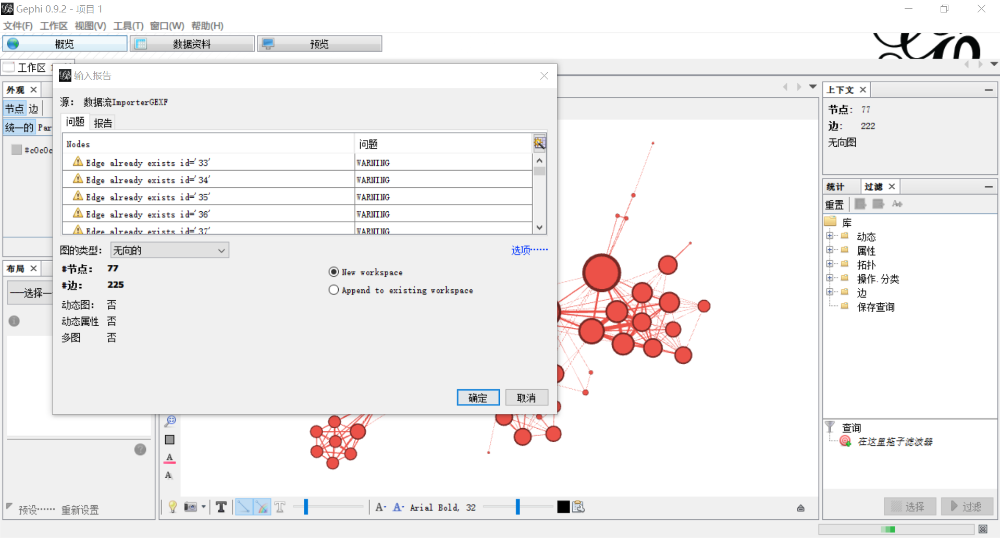

根据需要，可以选择导入到新的工作区（New workspace）或添加到现有工作区（Append to existing workspace）。

&emsp;&emsp;但更多时候，我们只有原始数据，而需要软件为我们生成网络图文件，这时 Gephi 也能很方便地满足我们的需要，支持以表格的形式批量导入结点和边的数据。

&emsp;&emsp;值得说明的是，我们建议最好将源数据保存为 `.csv` 或 `.tsv` 格式，因为两者都是以纯文本的形式储存表格数据，因此和 `.xlsx` 等表格格式相比，储存空间较小，打开速度更快。两者差别只在于，各列之间的数据在 `.csv` 文件中以英文逗号 `,` 分隔（即 Comma-Separated Value，逗号分隔值），而 `.tsv` 文件则是用制表符 `  ` 分隔的（即 Tab-Separated Value，制表符分隔值）。两者都可以直接在 Excel 中读写，下面的例子是用 `les-miserables.gexf` 导出的 `.csv` 文件。

&emsp;&emsp;结点的数据例如：

````csv
Id,Label,timeset,modularity_class
11,Valjean,,1
48,Gavroche,,8
55,Marius,,6
27,Javert,,7
25,Thenardier,,7
...
````

其中 `Id` 是结点数据的名称，必不可少；`Label` 则是显示给我们的标签。`timeset` 在静态图中无需设置，`modularity_class` 也可以根据需要设置成别的内容，下面导入时选择 `String`（字符串）即可。

&emsp;&emsp;边的数据例如：

````csv
Source,Target,Type,Id,Label,timeset,Weight
1,0,Undirected,0,,,1
2,0,Undirected,1,,,8
3,0,Undirected,2,,,10
3,2,Undirected,3,,,6
4,0,Undirected,4,,,1
...
````

其中 `Source` 是源节点，`Target` 是目标节点；`Type ` 可以用 `Undirected` 表示无向图，或用 `Directed` 表示有向图。以上三个参数是必不可少的。注意：`Source` 和 `Target` 两列中的数据都必须是结点的 `Id` 而非 `Label`，因为 `Id` 才是系统中储存的结点的名称。

&emsp;&emsp;编辑好数据后，在刚才添加结点和边的「数据资料」界面，单击「输入电子表格」，选择 `.csv` 文件后，确认输入的是结点或边的表格，注意要将字符集选为 `UTF-8` 才能正确显示汉字字符，如图所示：


导入结点和边的顺序可以颠倒，但在导入第二项时必须选择「添加到现有工作区」（Append to existing workspace），如图所示：


否则结点和边会分别导入到两个不同的工作表中，不能正确地显示数据。之后再回到「概览」窗口，就可以看到生成的网络图了。

#### 2.3.3. 外观的调整

&emsp;&emsp;为了便于查看网络图的信息，我们还可以在 Gephi 软件中对图的外观进行调整。在「概览」界面中，可以单击最下方黑色的字母 `T` 以显示结点的标签（label），并在右侧 `Arial Bold, 32` 处调节其大小、字体和颜色，效果如图所示：


类似地，我们也可以单击白色的字母 `T` 以显示边的标签，并调节其粗细。注意：对于默认字体中没有的字符编码，Gephi 软件不能自动回退（fallback）到其他字体，因此必须手动将其调整为相应的中文字体，才能正确地显示汉字或其他字符。

&emsp;&emsp;我们还可以在左侧的「外观」中设置结点和边的颜色和大小，可以按照度或其他预设的值进行区分。在选择颜色时，`Partition` 选项卡是以不同颜色区分结点或边的属性，而 `Ranking` 则是利用颜色的深浅表现数据的大小。设置完成后单击「应用」即可，调整后的效果如图所示：


&emsp;&emsp;除此之外，还可以在左下角「布局」窗口中选择网络图不同的布局。其中，`Force Atlas`、`ForceAtlas 2`、`Fruchterman Reingold`、`OpenOrd`、`Yifan Hu` 和 `Yifan Hu 比例` 六种是所谓力导向布局，模拟物理世界中的引力和斥力。比如 `Fruchterman Reingold` 布局的效果如图所示：

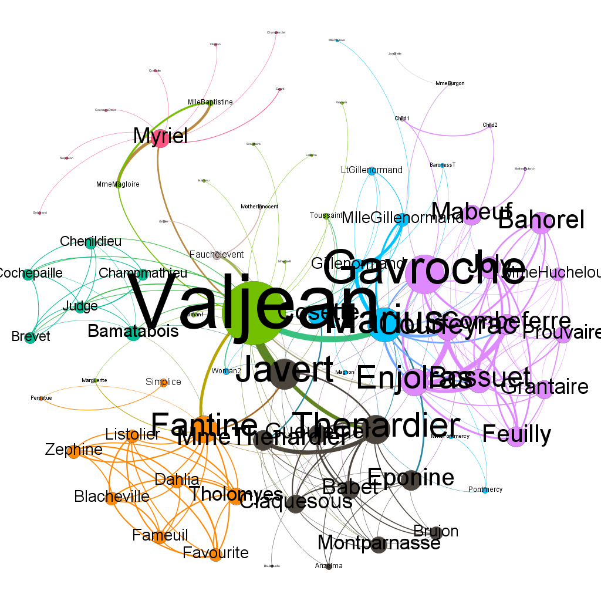

选择布局后还可以通过「布局」窗口下方的参数对网络图的外观进行更细致地调整。而 `Rotate` 、`交叠`、`扩展`、`收缩`、`标签调整` 五种则属于辅助性布局，可以用来调整图的大小、方向，避免结点交叉。

#### 2.3.4. 文件的保存

&emsp;&emsp;我们可以直接将网络图直接保存为默认的 `.gephi` 格式。虽然能完整地保留数据和各项设置，但只能在 Gephi 软件中打开。

&emsp;&emsp;如果要生成图片，有两种方式。其一是直接截屏，或者单击下方工具栏的照相机图标截屏。这种方式可以忠实地展现屏幕上的网络图，但图片的质量相对较低。另一种方法则是在菜单栏中选择 `文件(F) -> 输出 -> SVG/PDF/PNG文件`，然后在弹出的窗口中将「文件类型」设置为 `.png` 即可。

&emsp;&emsp;如果要生成 `.gexf` 文件，在菜单栏中选择 `文件(F) -> 输出 -> 图文件...`，将保存的文件类型设置为 `.gexf` 即可。要生成 `.json` 文件，则需在菜单栏中选择 `工具(T) -> 插件(G) -> 可用插件`，安装其中的 `JSON Exporter` 插件；待安装完成后，就可以按上述方法导出了。

### 2.4. JavaScript 的使用方法

&emsp;&emsp;前文已经提到，JavaScript 非常适合应用于前端的可交互展示。但由于可供选择的脚本众多，其配置方法也不完全相同，不能一一说明，如有需要可以直接参看其用户文档。下面我们主要介绍两款可以在 Gephi 软件的基础上直接生成 HTML 文件的脚本。

#### 2.4.1. Gexf.js

&emsp;&emsp;[Gexf.js](https://github.com/raphv/gexf-js) 是一款查看 `.gexf` 或 `.json` 图文件格式的插件，使用起来比较简单，只需要在下载到本地之后解压缩，把要查看的图文件复制到文件夹内。打开 `config.js`，在第四行双引号内输入图文件的名称：

````javascript
/*** USE THIS FILE TO SET OPTIONS ***/

GexfJS.setParams({
    graphFile : "les-miserables.gexf",
        /*
            The GEXF file to show ! -- can be overriden by adding
            a hash to the document location, e.g. index.html#celegans.gexf
            GEXF files can now be replaced by pre-processed JSON files (use gexf2json.py)
            for faster load time
        */
	...
````

保存后打开 `index.html` 文件即可，效果如图所示：


但根据其官方文档，对浏览器兼容的支持还不完善，可能出现无法显示的情况。

#### 2.4.2. Sigma.js

&emsp;&emsp;[Sigma.js](http://sigmajs.org/) 也可以把 `.json` 格式的图文件以 JavaScript 的形式展示出来。方便的是，我们可以利用 Gephi 的 `SigmaExporter` 插件直接生成（插件的安装方法参见上 [§2.3.4](#2.3.4.-文件的保存)）。

　　插件安装完成后，在菜单栏中选择 `文件(F) -> 输出 -> Sigma.js Template...`，弹出窗口的设置说明如下图所示：


设置完成后单击确定，就会在指定目录下生成一个名为 `network` 的文件夹，打开其中的 `index.html` 文件即可，效果如图所示：

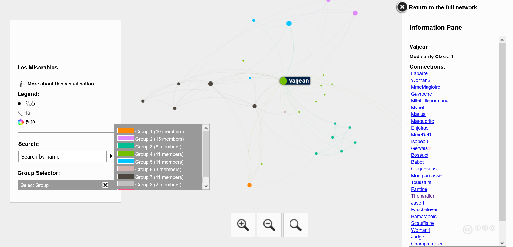

## 3. 现有研究成果综述

&emsp;&emsp;目前，网络分析方法在音韵学，特别是上古音领域的应用最广泛。首先需要说明的是：至少从现有的成果来看，网络分析并不是一种新的「研究方法」，而只是在传统研究方法的基础上，帮助我们认识、分析材料（或数据）的一种手段。因此，我们打算按照耿振生（[2004](#geng04)）对音韵学研究方法的总结，从韵脚字归纳、反切系联和谐声推演三个方面分别加以叙述。

### 3.1. 韵脚字归纳法

&emsp;&emsp;游函（List, [2016](#list16)）最早把网络分析引入传统的「丝贯绳牵法」或所谓「韵脚字系联法」（吕胜男, [2009](#lyu09)），并分析了《诗经》的韵脚字和潜在的韵脚字（potential rhyme words，即每章除去「之」「止」「也」「矣」等虚词外的最后一个字）。具体的处理方法是：

&emsp;&emsp;（1）结点：白一平（Baxter, [1992](#baxter92)）标记的全部韵脚字。结点的大小反映了这个韵脚字出现在潜在押韵位置的频数。

&emsp;&emsp;（2）边：连接《诗经》中押韵的两个结点。边的粗细反映了这两个字相押的次数，在同一韵段中的只计第一次，并用公式
$$W_{AB} = \frac{1}{G_{AB}-1} \tag{3}$$
进行归一化，其中的 $G_{AB}$ 是 $A$ 和 $B$ 两个字共现的韵段数。最终的结果如图所示：

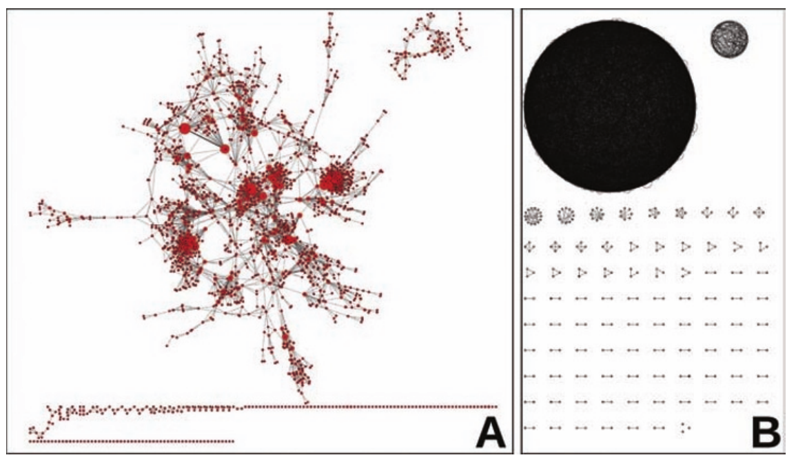

图中共有结点 1845 个。理论上说，边的数量是：
$$\nu = \frac{\epsilon^2-\epsilon}{2} = \frac{1845^2-1845}{2} = 1701090 \tag{4}$$
但实际上只有 5266 条。有趣的是，**几乎所有结点都是相连接的**。其中最多的有 1539 个字，占总数的 83%；其次的有 67 个字，占总数的 4%。但其实，整张图的结构还是能分成几个不同的部分，以最中央的之部为例：


其中绝大部分韵脚字都是相联的。


### 3.2. 反切系联法

#### 3.2.1. 游函（2018）的研究

&emsp;&emsp;游函（List, [2018](#list18)）利用网络分析方法，对《广韵》中反切上字的分组现象作了考察。

&emsp;&emsp;高本汉（[1915-1926](#karlgren15)）在陈澧《切韵考》的基础上，认为中古汉语声母有单纯的（série pure）和喻化的（série yodisée，即腭化的 pʲ kʲ tʲ 等 ）两类。这一说法遭到了一些中国学者的批评（参见陆志韦, [1939](#lu39); Chao, [1941](#chao41) 等）。为了考察这一问题，游函系联了《广韵》中的所有反切上字，结果如图所示：

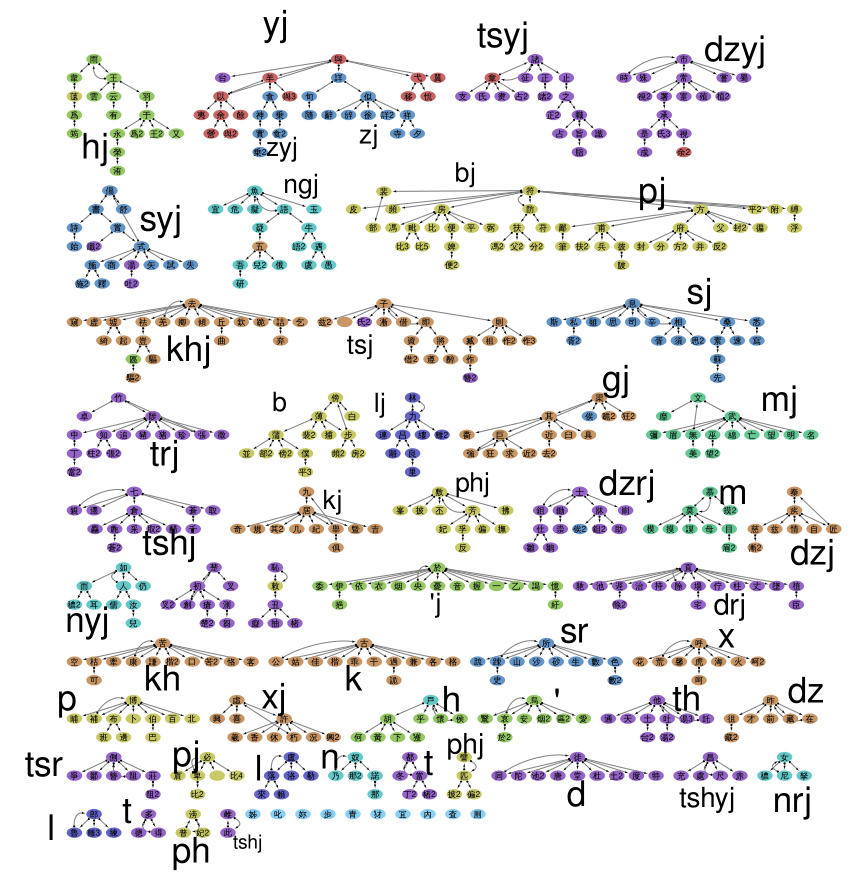

文章认为，各声类之间的界限是比较清晰的。至于帮母（*pj*-）和並母（*bj*-）之间的混切，则是多音字导致的，暂时还不能让计算机自动处理，还需要手动进行调整。

#### 3.2.2. 胡佳佳（2018）的研究

&emsp;&emsp;胡佳佳（[2018](#hu18)）从实际教学的角度出发，介绍了网络分析方法在系联《广韵》时的应用，下面分别介绍其系联反切上字和下字的方法。

&emsp;&emsp;在系联反切下字时，先找出一个韵内所有反切下字（我们记作 $U$），再查出这些字所在小韵的反切下字（我们记作 $V$），显然，$V \subseteq U$。因此，对于这两个集合中的元素 $u_i \in U$ 和 $v_i \in v$，有关联函数
$$\psi_G(e_i)=\{u_i, v_i\} \tag{5}$$
以五支韵为例，在 Gephi 软件中生成结果如下图所示（引自胡佳佳, [2018](#hu18): 159）：

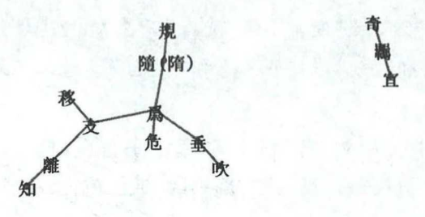

但我们认为这种方法有以下两点不足。其一，必须单独分析「上字同类者，下字必不同类」的情况，对分析条例的体现并不直观；其二，只对反切下字进行了系联，不便于像传统的以小韵为单位的系联一样，展现各个小韵之间同用、互用、递用的关系。（有关边的方向的问题，参见 [§4.1](#4.1.-方法)。）

&emsp;&emsp;类似地，我们也可以得到反切上字的系联结果，如图所示（引自胡佳佳, [2018](#hu18): 162）：

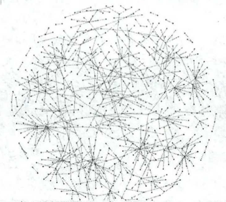

### 3.3. 谐声推演法

&emsp;&emsp;我们知道，形声字中包含着丰富的古音信息，为上古音研究提供了重要线索；但同时其信息又是十分复杂的，需要仔细甄别，特别是在声母方面，更是「言人人殊」，必须要持谨慎态度（耿振生, [2004](#geng04): §3）。网络分析方法的直观性，可以为我们更准确地认识谐声系统提供很多帮助。西方学者游函和丘内藤在这方面做出了初步的尝试。

#### 3.3.1. 游函（2018）的研究

&emsp;&emsp;游函（List, [2018](#list18): §2.1）利用有向图，分析了谐声层级中与三等/非三等的关系。蒲立本把上古汉语的音节分成两类，A 类是中古的非三等，B 类是中古的三等，有前腭介音 -*j*-。沙加尔（Sagart, [1999](#sagart99): §§2.7, 3.3.2）认为这两种类型和谐声系列有关。比如，在下图（引自 List, [2018a](#list18): 7）中，蓝色的结点属于 A 类，黄色的结点属于 B 类：


游函利用 Python 语言，分析了高本汉（Karlgren, [1957](#karlgren57)）中的 625 组谐声系列。如果某一组类中超过 70% 的字属于中古的三等，那么就归入上古的 B 类；反之，如果不到 30% 的字属于中古三等，则将其归入上古的 A 类。在这样的条件下，游函找到了 16 组谐声偏旁符合这一规律（见原文附录 B），并指出其中 8 组是「十分显著」的例子。

#### 3.2.2. 丘内藤、游函的研究

&emsp;&emsp;丘内藤、游函（Hill & List, [待刊](#hill-forthcoming)）又在游函（[2018](#list18)）的基础上作了进一步分析，讨论了和谐声系列有关的五种观点：

&emsp;&emsp;（1）沙加尔（Sagart, [1999](#sagart99)）认为上古汉语存在 A/B 两种音节类型，B 类在中古有 -*i*- 元音或 -*j*- 介音。检索出了 293 组，但有很多都不是截然分开的。除了上面提到的 #0001「可 A : 奇 B」之外，比较典型的还有 #0002「我 A : 義 B」、#0094「女 B : 奴 A」（参见 Sagart, [2017](#sagart17)）、#0256「袁 B : 睘 A」和 #0740「方 B : 旁 A」几组。井号后的数字是高本汉（Karlgren, [1957](#karlgren57)）的编号，下同。

&emsp;&emsp;（2）潘悟云（[2000](#panwuyun00)）和白一平、沙加尔（Baxter & Sagart, [2014](baxter14); Sagart & Baxter, [2009](#sagart09)）认为，见组和影母、以母的谐声来自于小舌音声母。只检索出了 30 组，尚不及提出这一理论时的材料。文章认为这种假说不如 A/B 类型音节有力，但也承认检索条件的设置可能不够合理。

&emsp;&emsp;（3）斯塔罗斯京（Старистин, [1989](#starostin89)）为上古汉语构拟了 \*-r 韵尾，以解释 -*a* < \*-aj 与 -*an* 的谐声，游函（List, [2016](#list16)）补充了押韵的证据；白一平、沙加尔（Baxter & Sagart, [2014](baxter14)）认为 \*r > \*-n 是演变的主流，而 \*r  > \*-j 则是东部方言的体现，但丘内藤（Hill, [2016](#hill16)）指出其论证缺乏系统性，因而不够可靠。本文找到了 17 组证据，但没有一组直接反映了 \*-r 韵尾的存在，因此认为还需要进一步研究。

&emsp;&emsp;（4）奥德里库尔（Haudricourt, [1954](#haudricourt54)）认为去声来自 \*-s 后缀，在和入声字谐声时，分别带 \*-ks、\*-ps 和 \*-ts 尾。其中的 \*-ts 在中古变为 -*j* 韵尾（\*-ts > \*-js > -*jH*），而 \*-ps 在更早的阶段与 \*-ts 合流，之后很快也经历了上述演变，因此在谐声系列中有 -p 和 -t 相混的例子，如 #0695「入 \*-p~ : 内 -\*ts : 讷 -\*t」。经检索，这样的谐声系列只有上述 #0695 一组。因此文章认为，尽管可能检索程序并不完善，但至少说明 \*-ps > \*-ts 的假说没有在谐声字中有直接的反映。

&emsp;&emsp;（5）甲伯连孜（Gabelentz, [1881](#gabelentz81)）注意到见组和来母的谐声，并认为见组来自 \*Kr- 声母，来母来自前缀 \*kə- 和 \*r- 声母。检索出的结果只有 13 组，而只有 #0766「各/路」一组是纯粹的见组和来母的谐声，因此文章认为此说是非常站不住脚的。

&emsp;&emsp;原始数据和处理结果分别见附件（[2019](#hill19)）中的 `/data` 和 `/output` 两个文件夹，在此不再赘述。

### 3.4. 其他

#### 3.4.1. 拟音的检验

&emsp;&emsp;如前所述，网络分析能在传统研究方法的基础上，帮助我们更好地处理、分析材料。除此之外，游函（List, [2018](#list18): §2.3.1）还按照探索性数据分析（exploratory data analysis）的思路，对比较拟音系统异同作出了尝试。需要说明的是，这篇文章中使用方法并非我们之前介绍的离散数学中的图论，而是最初诞生于生物学的 NeighborNet 算法（Bryant & Moulton, [2004](#bryant2004)）。这种算法可以展示调查对象明显的相同或相异，也被广泛地运用在语言学中的方言学和历史语言比较等领域（Bryant *et al.*, [2005](#bryant05); Heggarty *et al.* [2010](#heggarty10)）。

&emsp;&emsp;游函利用 [SplitsTree](http://www.splitstree.org/) 软件（参见 Huson, [1998](#huson98); Huson & Bryant, [2006](#huson06)），检验（evaluate）了白一平—沙加尔（Baxter & Sagart, [2014](baxter14)）、高本汉（Karlgren, [1950](#karlgren1950)）、李方桂（[1971](#lifanggui71)）、潘悟云（[2000](#panwuyun00)）、许思莱（Schuessler, [2007](#schuessler07)）、斯塔罗斯京（Старистин, [1989](#starostin89)）、王力（[1980](#wangli80)）和郑张尚芳（[2003](#zhengzhang03)）八家对《诗经》韵脚字主要元音拟音的异同，结果如下图所示（引自 List, [2018](#list18)）：

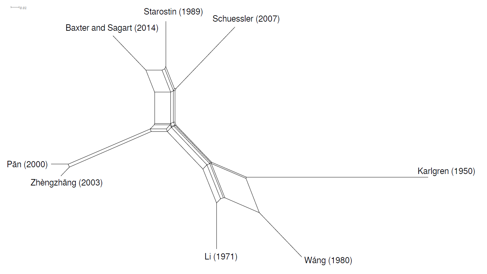

从图中我们不难看出，上述学者的拟音可以分成三组：（1）高本汉、李方桂、王力；（2）潘悟云、郑张尚芳；（3）斯塔罗斯京、许思莱、白一平—沙加尔。大而言之，也就是六元音和非六元音体系的对立。游函等（List *et al.*, [2017](#list-17)）分析了上述八家构拟系统的元音纯度（vowel purity），其中白一平—沙加尔、斯塔罗斯京和许思莱三家之间有着显著的差异；因此本文认为，这里第（3）组所反映的共性尤其值得注意。

#### 3.4.2. 训释的系联

&emsp;&emsp;目前而言，网络分析方法在古汉语的其他领域中的应用还比较有限。北京师范大学汉字研究与现代应用实验室（[2019](#bnu19)）制作的汉字全息资源应用系统（以下简称「全息库」）为我们展示了一个很好的思路。

&emsp;&emsp;全息库在「专书检索」选项卡中「综合系联」的「训释系联」功能里，使用了 JavaScript 的 vis.js 插件，实现了《说文》《尔雅》《释名》《方言》四本最为重要的小学专书中训释词和被训释词的自动系联，其效果如图所示：


不难看出，在左侧的菜单里可以自行设定被释词或训释词，并选择系联的范围和层级（最小为 1，最大为 5）。无疑，这一系统对我们更好地认识、分析词义系统是很有帮助的。但遗憾的是，全息库中的「构型系联」和「古音系联」都只是线性的列表，没有采用网络分析这一形式。

## 4. 用计算机系联《广韵》反切下字的方法

&emsp;&emsp;下面，我们以《广韵》反切下字的系联为例，具体说明网络分析在传统系联法中的应用。

### 4.1. 方法

&emsp;&emsp;显然，要以网络图 $G = \{ V, E \}$ 的形式对数据进行分析，首先就要处理好结点 $V$ 和边 $E$ 这两个要素，分别讨论如下。

&emsp;&emsp;在目前的研究成果中，都是以《广韵》中的反切为单位进行系联的。也就是说，图中的每个结点都代表一个反切下字（或上字）。显然，这可以规避反切用字不是小韵首字时的失联问题，使操作过程更加简便。但是，传统的系联法却是以小韵为单位系联的。这种办法的好处在于，可以更直观地显示系联时同用、互用、递用基本条例的运用，并在此基础上使用分析条例和补充条例。因此，本文提出的方法是以小韵为单位的，每个结点都代表《广韵》中的一个小韵。

&emsp;&emsp;在说明结点与结点如何用边连接，也就是关联函数 $\psi$ 之前，我们打算先讨论图中的边是否具有有向性。从目前的研究来看，胡佳佳（[2018](#hu18)）选择了无向图，而游函（List, [2018](#list18)）则使用了有向图。有趣的是，两位学者似乎都认为这种选择是不言自明的，并未详细论述<sup>【注】</sup>。我们认为，应当以使用有向图为宜，理由如下。

&emsp;&emsp;陆志韦（[1963](#lu63)）已经指出，在《王三》的反切中，有不少切上字和被切字的声母不符，切下字和被切字的介音不符的反切，并且很多都延续到了《广韵》里。这是由于反切是凭习惯造成的，「全靠作者对于母语有亲切的语音直感」，因此未必完全符合切上字管声母、切下字管韵母和声调这一抽象的音位学分析。换言之，反切上下字的拼读讲求协调、顺口，这一因素在反切用字的选择上起了很大作用。诚然，在系联《广韵》时，我们不得不把切上字和切下字拆分开来，分别考察。但既然反切和被切字之间并不是胡文认为的单纯的等价关系，因此我们认为有必要通过有向图的方式加以区分。当然，因为边的方向只是用来区分被切字和切下字，所以从逻辑上说，具体的方向是不重要的。

?> 【注】　胡佳佳（[2018](#hu18): 157）认为，「利用『被切字』与『反切上字』的等价关系划定出的等价类就是《广韵》的声类，利用『被切字』与『反切下字』等价关系划定出的等价类就是《广韵》的韵类。从网络分析的角度，将被切字与反切上字（或下字）看作网络中的结点，被切字与反切上字（或下字）的等价关系看作结点间的无向边（因为等价关系是双向的）」。游函（List, [2018](#list18): 10）的论证则更嫌草率，只说「反切与被切字的注音系统，可以很容易地转化成由反切到被切字的有向图」（The system underlying the *fǎnqiè* spelling, consisting of a *glossed character* and a *glossing character* can be easily translated into a system of *directed networks* in which we draw a link from the glossing character to the glossed character）。

&emsp;&emsp;下面我们讨论基本条例下关联函数 $\psi$ 的设置。前面已经说到，如果以切下字为结点系联，是很容易实现的，即：

$$\psi_G(e_i) = (u_i, v_i) \tag{6.1}$$

其中，$u_i \in U$ 是《广韵》中的反切下字，$v_i \in V$ 是 $u_i$ 的反切下字。显然 $V \subseteq U$，因此全部结点都可以直接相联。而如果要以小韵为结点系联，应该有：

$$\psi_G(e_i)=(n_i, u_i) \tag{6.2}$$

其中，$n_i \in N$ 表示《广韵》中的小韵首字，而 $u_i \in U$ 则是其相应的反切下字。但实际上，《广韵》中的反切下字并不一定都是小韵的代表字。比如一东韵中的「穷，去宫切」，「宫」在「弓」小韵，因此「穷」本应和「弓」小韵的反切下字系联为一类。但正是因为「宫」不是小韵首字，如果直接按照式 $(6.2)$ 的关联函数运行程序，就会导致这一类小韵的失联。因此在出现这种情况时，我们需要让计算机查找出这些反切下字所在小韵的代表字 $N'$，即：

$$\psi_G(e_i) = \begin{cases} (n_i, u_i), &u_i \in N \\ (n_i, n'_i), &u_i \not\in N \end{cases} \tag{6.3}$$

&emsp;&emsp;在具体实践中，我们可以让计算机自动检索所有反切下字 $V$ 所在的小韵代表字 $N'$，并用相应的 $N'$ 替换 $V$ 设置成目标结点。邓家钰师兄利用 VBA 语言实现了这一功能，可以参看附录中的 `.xlsm` 文件。此外，还有一种更简单的办法：既然《广韵》中的每个小韵都和一个音节一一对应，那么我们可以把所有结点的 ID 都设置成音标或序号；这样一来，$u_i$ 和 $n'_i$ 对计算机而言就是相同的两个结点，自然也就绕过了上述问题，可以直接系联起来了。这种方法还有另一个好处，只要原始数据处理得当，就可以规避如何让计算机处理多音字的问题。这也是此前研究都悬而未决的。

&emsp;&emsp;以上是对陈澧《切韵考》中基本条例的应用。除此之外，陈澧还发明了分析条例和补充条例。其中，分析条例是把可能系联而实际上不同类的反切上下字区分开来；而补充条例则是用来解决实际上不同类却不能直接系联的情况，有「又音互见定声类」和「四声相承定韵类」两种（耿振生, [2004](#geng04): 35-40）。这两种方法在之前的研究中也没能得到很好的解决。众所周知，「四声相承」作为一种类比推理，在逻辑上并不严谨，难于贯彻；「又音互见」的办法主要应用于反切上字的系联，因此都暂且不论。至于分析条例，由于技术所限，目前也还不能将其完全自动化，只能尽量清晰地将其显示出来后再手动处理、调整。

### 4.2. 材料

&emsp;&emsp;目前，比较易得、准确的《广韵》数据库的有以下三种：

1. [@polyhydron](https://www.zhihu.com/people/polyhedron/) 和 [@有女同车](https://zh.wikipedia.org/zh-hk/User:Blankego) 制作的 `广韵全字表.xlsx`（[2006](http://www.pkucn.com/viewthread.php?tid=175767)）；
2. [@poem](https://www.zhihu.com/people/poem) 制作的 `广韵字音表.xls`（[2017](https://zhuanlan.zhihu.com/p/20430939)）；
3. 游函（Johann-Mattis List）制作的 `guangyun.tsv`（[2018](#list2018)）。

我们这里选择的是数据最为完善的《广韵字音表》，并将其保存为 `poem-2017.csv`；再利用 Excel 的高级筛选功能，筛选出所有小韵，如图所示：

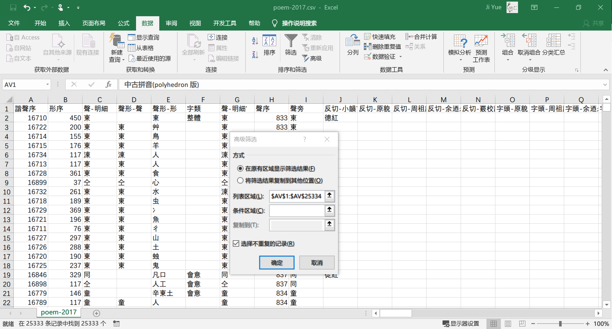

将结果复制到新的表格中，命名为 `xiaoyun.csv`。注意：在使用 Excel 的另存为功能生成 `.csv` 文件时，保存类型应该选择 `CSV UTF-8 (逗号分隔) (*.csv)` 而非  `CSV (逗号分隔) (*.csv)`，这样可以防止汉字字符的编码错误。

#### 4.2.1. 结点数据的编辑

&emsp;&emsp;我们先编辑结点的数据。用 Excel 新建一个 `nodes.csv` 文件，在第一行中输入表头：

````csv
Id,Label,Initial,Rhyme,Deng_hu,Char_num
````

在第二行里分别输入（为了醒目起见，这里分为六行）：

````csv
=xiaoyun.csv!AV2,
="【"&xiaoyun.csv!X2&"】"&xiaoyun.csv!V2&xiaoyun.csv!W2&F2,
=xiaoyun.csv!AE2,
=xiaoyun.csv!AM2&xiaoyun.csv!AN2,
=xiaoyun.csv!AF2&xiaoyun.csv!AG2&RIGHT(xiaoyun.csv!AU2, 1),
=xiaoyun.csv!AB3-xiaoyun.csv!AB2
````

然后利用 Excel 的快速填充功能，拖拽至工作表的第 3819 行，结果如下所示：

````csv
Id,Label,Initial,Rhyme,Deng_hu,Char_num
tung,【東】德紅17,端,上平01東,開一,17
dung,【同】徒紅45,定,上平01東,開一,45
triung,【中】陟弓4,知,上平01東,開三,4
driung,【蟲】直弓7,澄,上平01東,開三,7
cjung,【終】職戎15,章,上平01東,開三,15
...
phyap,【𥎰】孚法3,滂,上平01乏,合三,3
nriap,【䎎】女法3,娘,上平01乏,開三,3
thriap,【𦑣】丑法1,徹,上平01乏,開三,1
````

&emsp;&emsp;各列的说明如下：

1. `Id`：我们使用的是网络上流传较广的 [@polyhedron](http://zh.wikipedia.org/zh/User:Polyhedron) 版中古汉语拼音（[2005/2019](#polyhedron2005)）而非汉字，理由见上 [§1.3](1-思路) 节；
2. `Label`：包括小韵首字和反切；
3. `Initial`：声母；
4. `Rhyme`：韵目；
5. `Deng_hu`：等、开合；
6. `Char_num`：小韵收字。因为原表中没有《广韵》中各小韵的字数，所以我们用相邻两个字的《广韵》字序作了运算得到收字数。最后一个「𦑣」小韵的字数要在原表下的 `AB3819` 单元格补充数字 `25318`，才能得出正确的值。

#### 4.2.2. 边数据的编辑

&emsp;&emsp;下面我们编辑边的数据。类似地，新建文件 `edges.csv`，输入表头：

````csv
Id,Source,Target,Type,Weight
````

在各列中分别输入：

````csv
1,
=xiaoyun.csv!AV2,
=xiaoyun.csv!DC2,
Directed
=COUNTIF(B2, $C$2:$C$3819)+1
````

并填充至最后一行，结果如下所示：

````csv
Id,Source,Target,Type,Weight
1,tung,ghung,Directed,3
2,dung,ghung,Directed,1
3,triung,kiung,Directed,4
4,driung,kiung,Directed,1
5,cjung,njung,Directed,2
...
3816,phyap,pyap,Directed,1
3817,nriap,pyap,Directed,1
3818,thriap,pyap,Directed,1
````

&emsp;&emsp;其中 `Source` 是《广韵》中的全部小韵首字的中古汉语拼音（也就是 `nodes.csv` 中的 `Id` 一列）；`Target` 是其反切下字的拼音。 最后一列 `Weight` 表示的是结点的入度 $\delta_{G}^{-}$ 和出度 $\delta_{G}^{+}$ 之和。不难看出，对任意结点 $v \in N$，都有 $\delta_{G}^{+}(v)=1$，因此结点的度 $\delta_G(e)$ 实际上也就反映了这个小韵的字被用作反切下字的次数。

### 4.3. 数据分析

#### 4.3.1. 总体情况

&emsp;&emsp;将上述数据导入 Gephi 软件后，我们用结点的颜色表示所在的韵，大小表示其连入度，得到的结果如图所示：

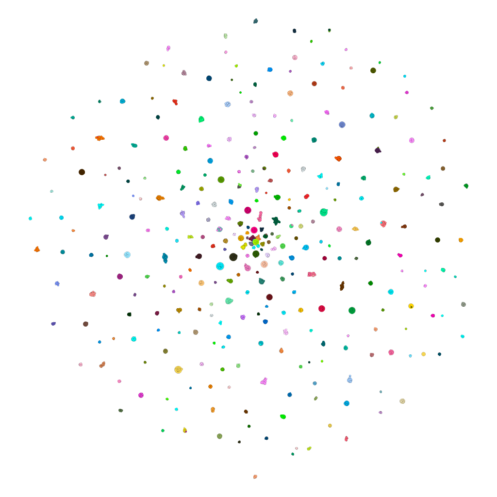

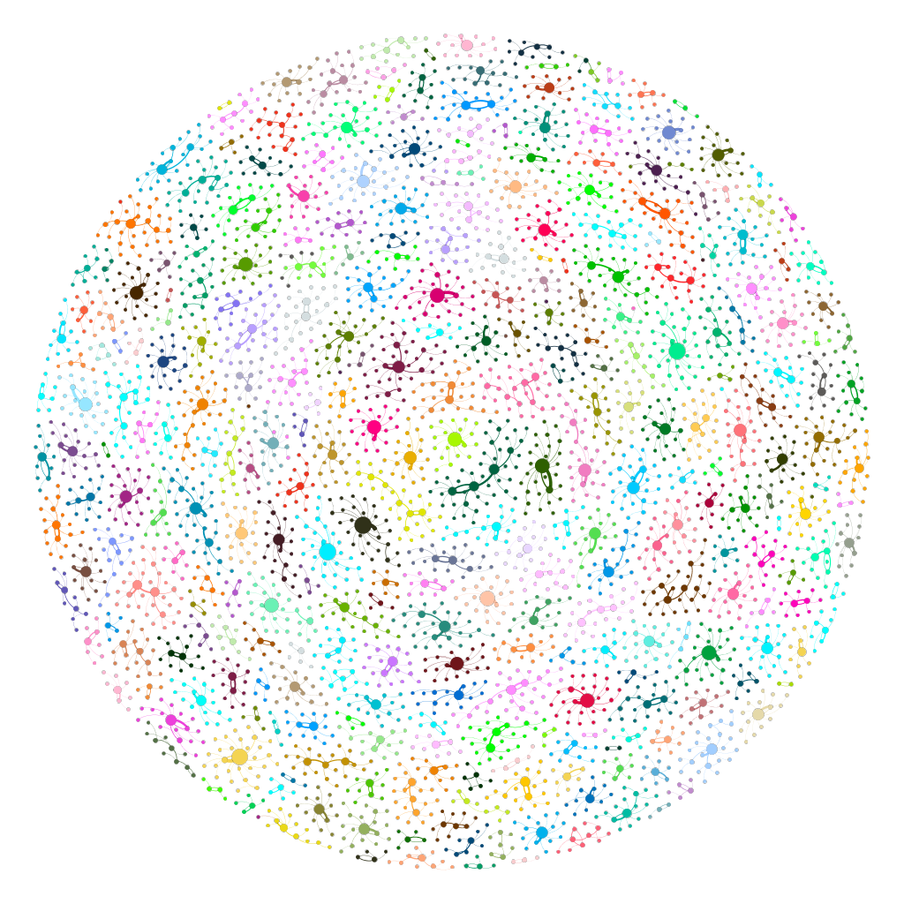

为了查看的方便，我们利用 Sigma.js 脚本把上述两种布局渲染为 HTML 文件，请分别参看 [Atlas Force 2](demo/gy-rhymes-force2/index.html ':ignore') 和 [Fruchterman Reingold](demo/gy-rhymes-force2/reingold.html ':ignore') 网页。

&emsp;&emsp;根据网络图和 Gephi 软件的统计数据，我们不难发现，在共计 3818 个结点中，度的最大值 $\Delta (G) = 23$ 出现于去声四十一漾韵中的亮小韵（其中一共只有 32 个小韵）；但平均度 $\bar \delta (G) = 1$，也就是说有绝大多数（2726 个，占总数超过七成）结点的入度 $\delta_{G}^{-} = 0$，如下图所示：

<iframe width="100%" height="450" src="https://www.itushuo.com/embed/dumiw" allowfullscreen="allowfullscreen" frameborder="0"></iframe>

此外，图中的连接部件共有 308 个，比《广韵》的韵目数多出一半之多。不难看出，这是用了其他韵的反切下字造成的。

## 5. 结语

---

# 附录


# 参考文献

- <a name="bnu19"></a>北京师范大学汉字研究与现代应用实验室 （2019） 《[汉字全息资源应用系统](http://qxk.bnu.edu.cn/)》。访问日期：2019 年 8 月 4 日。
- <a name="geng04"></a>耿振生 （2004） 《20 世纪汉语音韵学方法论》，北京大学出版社。
- <a name="hu18"></a>胡佳佳 （2018） [网络分析方法在音韵学教学中的应用——以《广韵》反切系联为例](http://kns.cnki.net/KCMS/detail/detail.aspx?dbname=cjfd2018&filename=lyyy201802013&dbcode=cjfq)，《励耘语言学刊》第 2 期，155-165 页。
- <a name="li71"></a>李方桂 （1971） [上古音研究](http://thjcs.web.nthu.edu.tw/files/14-1662-41727,r3013-1.php?Lang=zh-tw)，《清华学报》新 9 卷 1-2 期合刊，1-60 页。
- <a name="lu39"></a>陆志韦 （1939） [证《广韵》五十一声类](http://qikan.chaoxing.com/detail_38502727e7500f26f5f51a45e125bc4f6c0bd10351b2cdb01921b0a3ea255101fc1cf1fbb4666ae6677ff564eba69bb038638253d94355cf200bf6efa945afa1c4636e9b134e0c35fb4bf0a7a861571c20b88c6e534e6905ff2392838a1740b511270bb1d955dcf1adfd43ad95f43916)，《燕京学报》第 25 期，4-62 页。
- <a name="lu63"></a>——— （1963） [古反切是怎样构造的](http://qikan.chaoxing.com/detail_38502727e7500f26ef0c228fd4b949eb9f59f7d6c85e69051921b0a3ea255101fc1cf1fbb4666ae6dd1e65f26d5d83ec532ac29aeda4b1ae11590f99b927935ebee72562d27b55a67245949a1d00025d20b88c6e534e6905ff2392838a1740b511270bb1d955dcf1adfd43ad95f43916)，《中国语文》第 5 期，349-385 页。
- <a name="lyu09"></a>吕胜男 （2009） [古韵研究方法论发微——兼论今文《尚书》用韵研究](http://kns.cnki.net/KCMS/detail/detail.aspx?dbcode=CJFQ&dbname=CJFD2009&filename=NYSF200902013&v=Mjc1MjhiK2RtRkN2a1dyL0lLelRZYUxHNEh0ak1yWTlFWjRSOGVYMUx1eFlTN0RoMVQzcVRyV00xRnJDVVJMT2Y=)，《南阳师范学院学报》第 2 期，57-61 页。
- <a name="pan00"></a>潘悟云 （2000） 《[汉语历史音韵学](http://ss.chaoxing.com/detail_38502727e7500f26948ae00ae43ed04b0166c8dc4cf254ac1921b0a3ea25510134114c969f2eae5cf770a7817db5547e23424148916511d53ca13e30ae0eb1ab10b9df34c243887f985ec7a161a0fd58dbee62b8ac2d3a0684882097c756e02f4cd73b6bf75669750be53d09c89beee1)》，上海教育出版社。
- <a name="sagart17"></a>沙加尔 （2017） [先秦时期谐声声符的选择问题](http://www.academia.edu/35852895/)，马坤译，澳门大学中国语言文学系、香港浸会大学饶宗颐国学院：「上古音与古文字研究的整合」国际研讨会（International Conference on the Integration of Old Chinese Phonology and Paleography）会议论文。
- <a name="wang80"></a>王　力 （1980） 《[诗经韵读](http://ss.chaoxing.com/detail_38502727e7500f2685813c708ce0786aaf8041489ad86e531921b0a3ea25510134114c969f2eae5c1b9870d3ae764f4172ee75f7146bf19e8612e478be325ef73654d2d6ef57b06bc824e12fd131fe66dbee62b8ac2d3a0684882097c756e02f4cd73b6bf75669750be53d09c89beee1)》，上海古籍出版社。
- <a name="zhengzhang03"></a>郑张尚芳 （2003） 《[上古音系](http://ss.chaoxing.com/detail_38502727e7500f26ae57f47486058009dd51532e616389a21921b0a3ea25510134114c969f2eae5c785da39c86ddf4dbb79c6a46ee50035e10173feba253cf74ec1d8d4fa808af44f1ecae5f95718118dbee62b8ac2d3a0684882097c756e02f4cd73b6bf75669750be53d09c89beee1)》，上海教育出版社。
- <a name="baxter14"></a>Baxter, W. H. 白一平, & Sagart, L. 沙加尔 (2014). [*Old Chinese: a New Reconstruction*](https://doi.org/10.1093/acprof:oso/9780199945375.001.0001). Oxford: Oxford University Press.
- <a name="bondy13"></a>Bondy, J. A., & Murty, U. S. R. (2013). [*Graph Theory*](https://www.springer.com/gp/book/9781846289699). 3rd ed. Berlin, Heidelberg: Springer-Verlag. 第一版汉译本：《图论及其应用》，吴望名译，科学出版社，1984 年。
- <a name="brandes05"></a>Brandes, U., & Erlebach, T. (2005). [*Network Analysis: Methodological Foundations*](https://link.springer.com/book/10.1007/b106453). Berlin, Heidelberg: Springer-Verlag.
- <a name="bryant04"></a>Bryant, D., & Moulton, V. (2004). [Neighbor-Net: an agglomerative method for the construction of phylogenetic networks](https://doi.org/10.1093/molbev/msh018). *Molecular Biology and Evolution*, 21(2), 255-265.
- <a name="bryant2005"></a>Bryant, D., Filimon, F., & Gray, R.D. (2005). [Untangling our past: Languages, Trees, Splits and Networks](http://hdl.handle.net/11858/00-001M-0000-0027-BB27-A). In R. Mace, C. J. Holden, & S. Shennan (Eds.), *The evolution of cultural diversity: a phylogenetic approach* (pp. 67-84). London: UCL Press.
- <a name="chao41"></a>Chao, Y. R. 赵元任 (1941). [Distinctions within Ancient Chinese](http://qikan.chaoxing.com/detail_38502727e7500f26a8850c03a9349f554358a57a768c47091921b0a3ea255101c944b624736f9e85530edd1bd6d1c76bceea510be5835f1876361250cb07899454659a22e94f59a302b954de820e4c3020b88c6e534e6905ff2392838a1740b51b2507ad4cb47a2fadfd43ad95f43916). *Harvard Journal of Asiatic Studies*, 5(3-4), 203-233.
- <a name="csardi06"></a>Csárdi, G., & Nepusz, T. (2006). [The iGraph Software Package for Complex Netwrok Research](https://www.researchgate.net/publication/221995787_The_Igraph_Software_Package_for_Complex_Network_Research/citation/download). *InterJournal, Complex Systems*, 1695, 1-9.
- <a name="gabelentz81"></a>Gabelentz, G. v. d. 甲伯连孜 (1881) 1953. *Chinesische Grammatik: mit Ausschluss des niederen Stiles und der heutigen Umgangssprache*. Reprint. Berlin: Deutscher Verlag der Wissenschaften. 汉译本：《[汉文经纬](http://ss.chaoxing.com/detail_38502727e7500f267263145b8f0d4a08e8f119fe1d4871971921b0a3ea25510134114c969f2eae5c891dbbc16f6853f6c49003cdc28b796729a46c91d054a15975755caf0cb8307a9a91d084a83f9082dbee62b8ac2d3a0684882097c756e02f4cd73b6bf75669750be53d09c89beee1)》，姚小平译，外语教学与研究出版社，2015 年。
- <a name="hagberg08"></a>Hagberg, A. A., Schult, D. A., & Swart, P. J. (2008). [Exploring network structure, dynamics, and function using NetworkX](http://conference.scipy.org/proceedings/SciPy2008/paper_2/). In G. Varoquaux, T. Vaught, & J. Millman (Eds.) *Proceedings of the 7th Python in Science Conference* (pp. 11-15).
- <a name="haudricourt54"></a>Haudricourt, A.-G. 奥德里库尔 (1954). [Comment Reconstruire Le Chinois Archaïque](https://doi.org/10.1080/00437956.1954.11659532). *Word*, 10(2-3), 351-364.
- <a name="heggarty10"></a>Heggarty, P., Maguire, W., & McMahon, A. (2010). [Splits or waves? Trees or webs? How divergence measures and network analysis can unravel language histories](https://doi.org/10.1098/rstb.2010.0099). *Philosophical Transactions of the Royal Society B: Biological Sciences*, 365(1559), 3829-3843.
- <a name="hill16"></a>Hill, N. W. 丘内藤 (2016). [The Evidence for Chinese \*-r](https://doi.org/10.1163/2405478X-00902003) 古汉语 \*-r 尾音的证据. *Bulletin of Chinese Linguistics* 中国语言学集刊, 9(2), 190-204.
- <a name="hill-forthcoming"></a>Hill, N. W. 丘内藤, & List, J.-M. 游函 (forthcoming). [Using Chinese character formation graphs to test proposals in Chinese historical phonology](http://lingulist.de/documents/papers/hill-list-2019-chinese-character-formation-graphs.pdf). *Bulletin of Chinese Linguistics* 中国语言学集刊. <a name="hill19"></a>数据和源码见 (2019). [Data and Code for «Using Chinese character formation graphs to test proposals in Chinese historical phonology»](http://doi.org/10.5281/zenodo.3246393). Zenodo.
- <a name="hunter07"></a>Hunter, J. D. (2007). [Matplotlib: A 2D Graphics Environment](https://doi.org/10.1109/MCSE.2007.55). *Computing in Science & Engineering*, 9(3), 90-95.
- <a name="huson98"></a>Huson, D. H. (1998). [SplitsTree: analyzing and visualizing evolutionary data](https://doi.org/10.1093/bioinformatics/14.1.68). *Bioinformatics*, 14(1), 68-73.
- <a name="huson06"></a>Huson, D. H., & Bryant, D. (2006). [Application of Phylogenetic Networks in Evolutionary Studies](https://doi.org/10.1093/molbev/msj030). *Molecular Biology and Evolution*, 23(2), 254-267. 
- <a name="karlgren15"></a>Karlgren, B. 高本汉 (1915-1926). *Études sur la Phonologie Chinoise*. Leiden and Stockholm: Norstedt. 汉译本：《中国音韵学研究》，赵元任、罗常培、李方桂译，商务印书馆，1940 年。
- <a name="karlgren50"></a>—— (1950). *The Book of Odes: Chinese text, transcription and translation*. Stockholm: Museum of Far Eastern Antiquities. 
- <a name="karlgren57"></a>—— (1957). [Gramma Serica Recensa](http://ss.zhizhen.com/detail_38502727e7500f26f1ce104a15568ce8e2ee8db6d8d18d4d1921b0a3ea255101ff20232bc5d7271392ca6eb2c71318865155c5438fbb21eab02f26b59238cf601ee603dc6f3d002408283ada86f7e698?). *Bulletin of the Museum of Far Eastern Antiquities*, 29, 1-332. 汉译本：《[汉文典](http://ss.chaoxing.com/detail_38502727e7500f26ea2dfaed11771665fed4b47e2deecb0f1921b0a3ea25510134114c969f2eae5cc744720e3130b751ed88dfe5746c33d69cb51d43696fa7ef69b6d1a0a8fc4207a97d90f05deb3b9ddbee62b8ac2d3a0684882097c756e02f4cd73b6bf75669750be53d09c89beee1)》，潘悟云、杨剑桥、陈重业、张洪明译，上海辞书出版社，1997 年。
- <a name="list16"></a>List, J.-M. 游函 (2016). [Using network models to analyze Old Chinese rhyme data](https://doi.org/10.1163/2405478X-00902004) 用网络模型来分析古代汉语的韵母数据. *Bulletin of Chinese Linguistics* 中国语言学集刊, 9(2), 218-241. 数据和源代码见 [digling/shijing: Data and Code for the Shījīng Network Analysis (Version v1.0)](http://doi.org/10.5281/zenodo.167341). Zenodo. 
- <a name="list18"></a>—— (2018). [More on network approaches in Historical Chinese Phonology (音韻學)](https://hal.archives-ouvertes.fr/hal-01706927v2/document). Paper prepared for the LFK Society Young Scholars Symposium. Taipei: Li Fang-Kuei Society for Chinese Linguistics. 数据和源代码见. [Source Code Accompanying the Paper "More on network approaches in Historical Chinese Phonology (音韻學)"](http://doi.org/10.5281/zenodo.1171967). Zendo. 
- <a name="list17"></a>List, J.-M. 游函, Pathmanathan, J. S., Hill, N. W. 丘内藤, Bapteste, E., & Lopes, P. (2017). [Vowel purity and rhyme evidence in Old Chinese reconstruction](https://doi.org/10.1186/s40655-017-0021-8). *Lingua Sinica*, 3(1), 1-17. 数据和源代码见 [digling/vowel-purity-paper: Official publication release (version 1.0)](http://doi.org/10.5281/zenodo.232163). Zenodo.
- <a name="newman10"></a>Newman, M. E. J. (2010): [*Networks: an Introduction*](https://www.oxfordscholarship.com/view/10.1093/acprof:oso/9780199206650.001.0001/acprof-9780199206650). New York: Oxford University Press.
- <a name="sagart99"></a>Sagart, L. 沙加尔 (1999). [*The Roots of Old Chinese*](https://doi.org/10.1075/cilt.184). Philadelphia: John Benjamins. 汉译本：《[上古汉语词根](http://ss.chaoxing.com/detail_38502727e7500f264b1a17c7914b5b8eb7d8e42d1448219a1921b0a3ea25510134114c969f2eae5cd8a964fdd6ecd3537ea0d09aa8e546031ebd9f0dd9d277dcf3cd01ab5af9a0309d28201b67a7f78bdbee62b8ac2d3a0684882097c756e02f4cd73b6bf75669750be53d09c89beee1)》，龚群虎译，上海教育出版社，2004 年。
- <a name="sagart09"></a>Sagart, L. 沙加尔, & Baxter, W. H. 白一平 (2009). [Reconstructing Old Chinese uvulars in the Baxter-Sagart system (Version 0.99)](https://doi.org/10.1163/1960602809X00027). *Cahiers de Linguistique Asie Orientale*, 38(2), 221-244.
- <a name="schuessler07"></a>Schuessler, A. 许思莱, comp. (2007). *ABC Etymological Dictionary of Old Chinese*. Honolulu: University of Hawai’i Press.
- <a name="starostin12"></a>Старостин, С.А. (Starostin, S.A.) 斯塔罗斯京 (1989) *Реконструкция Древнекитайской Фонологической Системы* (*Reconstruction of the Phonological System of Old Chinese*). Москва: Наука. 汉译本：《古代汉语音系的构拟》，张兴亚译，唐作藩审定，北京大学出版社，2012 年。
</span>