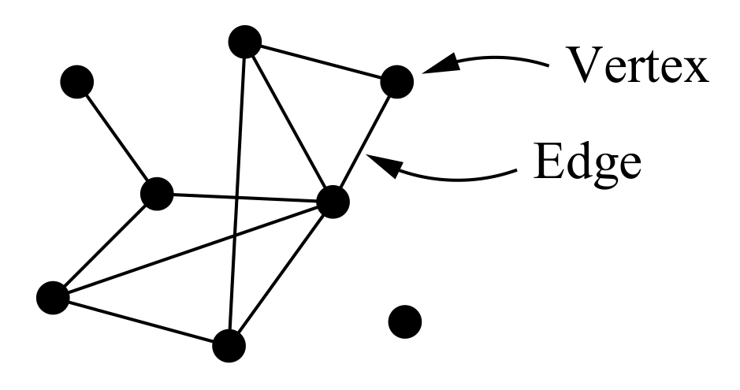
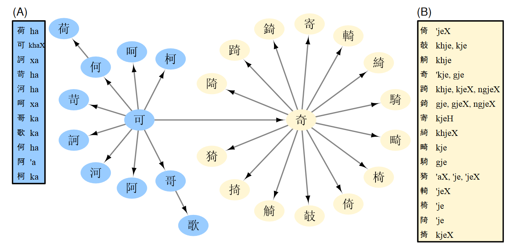
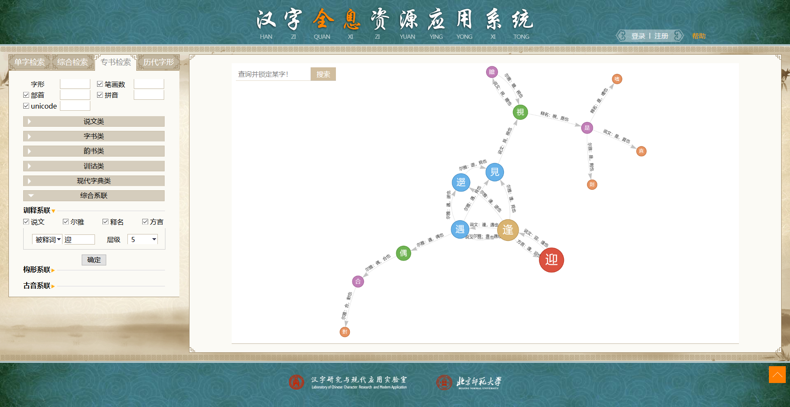

# 网络分析方法及其在古汉语研究中的应用述要

<!-- TOC -->

- [网络分析方法及其在古汉语研究中的应用综述](#网络分析方法及其在古汉语研究中的应用综述)
    - [1. 网络分析的基本概念](#1-网络分析的基本概念)
    - [2. 网络图的实现方法](#2-网络图的实现方法)
    - [3. 网络分析与音韵学研究](#3-网络分析与音韵学研究)
        - [3.1. 韵脚字归纳法](#3.1.-韵脚字归纳法)
        - [3.2. 反切系联法](#3.2.-反切系联法)
        - [3.3. 谐声推演法](#3.3.-谐声推演法)
        - [3.4. 拟音的检验](#3.4.-拟音的检验)
    - [4. 网络分析方法的其他运用](#4-网络分析方法的其他运用)
    - [5. 结语](#5-结语)
    - [参考文献](#参考文献)

<!-- /TOC -->

## 1. 网络分析的基本概念

　　**1.1** 简而言之，**网络**（network）是由线段连接在一起的点的集合，在物理学、生物学和社会学等领域中都有广泛的应用。下面简单地介绍一些基本概念，更多内容可以参见 Brandes & Erlebach（[2005](#brandes2005)）、Bondy & Murty（[2013](#bondy2013)）等专著。

　　按照离散数学中图论（graph theory）的术语，各个点被称作**顶点**（vertices）或**结点**（nodes），而连接结点的线段（或弧线）称之为**边**（edges），如图所示（引自 Newman, [2010](#newman2010)）：

　　**1.2** 一个**网络图**（graph）可以用 $G = (V , E)$ 的形式来表示。图中，结点的集合记作 $V(G) = \{ v_1, v_2, v_3, \cdots, v_n \}$，边的集合记作 $E(G)=\{e_1, e_2, e_3, \cdots, e_n\}$；而结点和边的数量则分别用相应的希腊字母 $\upsilon$ 和 $\epsilon$ 表示。结点之间的关系称作**关联函数**，记作 $\psi_G (e)$。

　　网络图既可以是无方向的（undirected），也可以是有方向的（directed）。我们用 $D$ 表示有向图。

　　对于两个结点 $u,v \in V$ 所组成的边 $e$，可以直接写成 $u v$。在无向图中记作 $\psi_G(e)=\{u,v\}$；在有向图中则记作 $\psi_D(e)=(u,v)$，我们称其中的 $u$ 是 $e$ 的**源结点**（或头），$v$ 是 $e$ 的**目标结点**（或尾）。

　　**1.3** 在一个无向的网络图 $G$ 中，结点的**度**（degree）是指和结点 $v$ 相交的边的数量，记作 $d_G(v)$；结点度的最大值记作 $\Delta (G)$，最小值记作 $\delta (G)$。对有向图 $D$ 来说，还区分**入度**（indegree，即以 $v$ 为头的边的数目）和**出度**（outdegree，即以 $v$ 为头的边的数目），分别记作 $d_{D}^{-}$ 和 $d_{D}^{+}$。

## 2. 网络图的实现方法

　　**2.1** 通过计算机制作网络图的方法很多，主要有以下几类：

1. [Python](https://www.python.org/) 语言，需要配合 [NetworkX](http://networkx.github.io/) 和 [Matplotlib](https://matplotlib.org/) 等扩展包（package）；
2. [JavaScript](https://www.javascript.com) 脚本，比如 [AnyChart](https://www.anychart.com/chartopedia/chart-type/network-graph/)、[Cola.js](https://ialab.it.monash.edu/webcola/)、[D3.js](https://d3js.org/)、[ECharts.js](http://echarts.baidu.com/)、[Gexf.js](https://github.com/raphv/gexf-js)、[Sigma.js](http://sigmajs.org/) 和 [Vis.js](https://visjs.org/) 等；
3. 其他网络分析及其可视化软件，如 [AllegroGraph](https://allegrograph.com/)、[Gephi](https://gephi.org/) 、[NetMiner](http://www.netminer.com/main/main-read.do) 等。

除此之外，还有 [R](https://www.r-project.org/) 语言和在线平台 [Graph Commons](https://graphcommons.com) 等很多工具或软件也可以实现类似的效果，具体情况可以参见维基百科的 [en:Social network analysis software](https://en.wikipedia.org/wiki/Social_network_analysis_software) 词条。

　　由于篇幅所限，每种工具的使用用法也各不相同，因此这里不打算介绍的操作步骤（可以参见[这篇文档](../network-tutorial/README.md)），只是对上述这三种方式的优缺点进行简要的评述。

　　**2.2** 作为一门编程语言，Python 的使用需要安装相应的编程环境和 NetworkX（Hagberg *et al.*, [2008](#hagberg2008)）、Matplotlib（Hunter, [2007](#hunter2007)）两个扩展包，而且所有设置都需要以编程命令的形式完成，因此相对而言直观性较差，安装、学习的成本较高。但也正得益于此，Python 具有更强的可定制性，加之其开源、活跃的社区，让使用者可以根据自己的实际需要灵活调整其配置，并直接编写相关程序以展开后续的数据分析工作。

　　通过 JavaScript 实现网络图制作与分析的脚本很多，选择丰富，其使用方式也不尽相同。总体说来，使用 JavaScript 同样要安装一定编程环境，还需要一些 HTML/CSS 的基础知识。但 JavaScript 作为一门 Web 编程语言，被广泛运用于几乎所有现代的 HTML 网页上，因此虽然其数据处理能力稍弱，但由于 JavaScript 不仅可以生成图片，更能够以可交互的形式应用在网页上，不受平台和软件格式的限制，十分便于结果的查看和共享。

　　网络分析软件一般有较为直观的图形化界面，可以方便地导入、管理、分析数据，相对来说最易于掌握。其中的 Gephi 更是以其跨平台、开源易用、功能强大的特点，成为最流行的网络分析软件之一；但缺点在于打开速度相对较慢，而且生成的结果必须在专门软件中查看才能有交互性。也就是说，在查看和共享网络图的时候，如果没有安装相应的软件，就只能输出为静态的图片格式，而这在结点数据较多时显然不能清晰地反映其间的关系。

　　**2.3** 通过上述分析，我们认为较好的解决方案是：用 Gephi 软件将原始数据制作成网络图，再将结果生成为 `.gexf` 或 `.json` 格式（而非默认配置下直接保存得到的 `.gephi` 文件）。这样，我们可以在 JavaScript 中直接调用网络图的数据文件制作 HTML 文档，或是直接显示在 [Observable](https://observablehq.com/) 等在线平台上，以便查看网络图的结果。

## 3. 网络分析与音韵学研究

　　目前，网络分析方法在音韵学，特别是上古音领域的应用较为广泛。但首先需要说明的是：从现有的成果来看，网络分析并不是一种新的「研究方法」，只是在传统研究方法的基础上，帮助我们认识、分析材料（或数据）的一种手段。因此，我们按照耿振生（[2004](#gengzhensheng2004)）对音韵学研究方法的总结，从韵脚字归纳、反切系联和谐声推演三个方面分别加以叙述。

### 3.1. 韵脚字归纳法

　　游函（List, [2016](#list2016)）最早用网络分析方法系联了《诗经》押韵。

### 3.2. 反切系联法

　　**3.2.1** 游函（List, [2018](#list2018)）利用网络分析方法，对《广韵》中反切上字的分组现象作了考察。

　　高本汉（[1915-1926](#karlgren1915)）在陈澧《切韵考》的基础上，认为中古汉语声母有单纯的（série pure）和喻化的（série yodisée，即腭化的 pʲ kʲ tʲ 等 ）两类。这一说法遭到了一些中国学者的批评（参见陆志韦, [1939](#luzhiwei1939); Chao, [1941](#chao1941) 等）。为了考察这一问题，游函系联了《广韵》中的所有反切上字，结果如图所示：

文章认为，各声类之间的界限是比较清晰的。至于帮母（*pj*-）和並母（*bj*-）之间的混切，则是多音字导致的，需要手动进行调整。

　　**3.2.2** 胡佳佳（[2018](#hujiajia2018)）从实际教学的角度出发，介绍了网络分析方法在系联《广韵》时的应用，下面分别介绍其系联反切上字和下字的方法。

　　在系联反切下字时，先找出一个韵内所有反切下字（我们记作 $V$），再查出这些字所在小韵的反切下字（我们记作 $V'$），显然 $V' \subseteqq V$，又因为「反切下字之间的韵类等价关系是双向的，所以网络图中的边是无方向的」，就可以建立关联函数 $\psi_G(e)=\{V, V'\}$。以五支韵为例，在 Gephi 软件中生成结果如下图所示（引自胡佳佳, [2018](#hujiajia2018): 159）：

但我们认为这种方法有以下两点不足。其一，必须单独分析「上字同类者，下字必不同类」的情况，对分析条例的体现并不直观；其二，只对反切下字进行了系联，不便于像传统的以小韵为单位的系联一样，展现各个小韵之间同用、互用、递用的关系。

　　系联反切上字的方法与之基本相同，先列出《广韵》中全部反切上字（我们记作 $U$），再查出这些字所在小韵的反切上字（我们记作 $U'$）。类似地，我们也可以得到关联函数 $\psi_H(e)=\{U, U'\}$，生成的网络图如下所示（引自胡佳佳, [2018](#hujiajia2018): 162）：

### 3.3. 谐声推演法

　　我们知道，形声字中包含着丰富的古音信息，为上古音研究提供了重要线索；但同时其信息又是十分复杂的，需要仔细甄别，特别是在声母方面，更是「言人人殊」，必须要持谨慎态度（耿振生, 2004: §3）。网络分析方法的直观性，可以为我们更准确地认识谐声系统提供很多帮助。西方学者游函和丘内藤在这方面做出了初步的尝试。

　　**3.3.1** 游函（List, [2018](#list2018): §2.1）利用有向图，分析了谐声层级中与三等/非三等的关系。蒲立本把上古汉语的音节分成两类，A 类是中古的非三等，B 类是中古的三等，有前腭介音 -*j*-。沙加尔（Sagart, [1999](#sagart1999): §§2.7, 3.3.2）认为这两种类型和谐声系列有关。比如，在下图（引自 List, [2018a](#list2018): 7）中，蓝色的结点属于 A 类，黄色的结点属于 B 类：

游函利用 Python 语言，分析了高本汉《汉文典》（Karlgren, [1957](#karlgren1957)）中的 625 组谐声系列。如果某一组类中超过 70% 的字属于中古的三等，那么就归入上古的 B 类；反之，如果不到 30% 的字属于中古三等，则将其归入上古的 A 类。在这样的条件下，游函找到了 16 组谐声偏旁符合这一规律（见原文附录 B），并指出其中 8 组是「十分显著」的例子。

　　**3.3.2** 丘内藤、游函（Hill & List, [待刊](#hill-forthcoming)）又在游函（[2018](#list2018)）的基础上作了进一步分析，讨论了和谐声系列有关的五种观点：

　　（1）沙加尔（Sagart, [1999](#sagart1999)）认为上古汉语存在 A/B 两种音节类型，B 类在中古有 -*i*- 元音或 -*j*- 介音。检索出了 293 组，但有很多都不是截然分开的。除了上面提到的 #0001「可~A~ : 奇~B~」之外，比较典型的还有 #0002「我~A~ : 義~B~」、#0094「女~B~ : 奴~A~」（参见 Sagart, [2017](#sagart2017)）、#0256「袁~B~ : 睘~A~」和 #0740「方~B~ : 旁~A~」几组。井号后的数字是高本汉《汉文典》的编号，下同。

　　（2）潘悟云（[2000](#panwuyun2000)）和白一平、沙加尔（Baxter & Sagart, [2014](baxter2014); Sagart & Baxter, [2009](#sagart2009)）认为，见组和影母、以母的谐声来自于小舌音声母。只检索出了 30 组，尚不及提出这一理论时的材料。文章认为这种假说不如 A/B 类型音节有力，但也承认检索条件的设置可能不够合理。

　　（3）斯塔罗斯京（Старистин, [1989](#starostin1989)）为上古汉语构拟了 \*-r 韵尾，以解释 -*a* < \*-aj 与 -*an* 的谐声，游函（List, [2016](#list2016)）补充了押韵的证据；白一平、沙加尔（Baxter & Sagart, [2014](baxter2014)）认为 \*r > \*-n 是演变的主流，而 \*r  > \*-j 则是东部方言的体现，但丘内藤（Hill, [2016](#hill2016)）指出其论证缺乏系统性，因而不够可靠。本文找到了 17 组证据，但没有一组直接反映了 \*-r 韵尾的存在，因此认为还需要进一步研究。

　　（4）奥德里库尔（Haudricourt, [1954](#haudricourt1954)）认为去声来自 \*-s 后缀，在和入声字谐声时，分别带 \*-ks、\*-ps 和 \*-ts 尾。其中的 \*-ts 在中古变为 -*j* 韵尾（\*-ts > \*-js > -*jH*），而 \*-ps 在更早的阶段与 \*-ts 合流，之后很快也经历了上述演变，因此在谐声系列中有 -p 和 -t 相混的例子，如 #0695「入~*-p~ : 内~-*ts~ : 讷~-t~」。经检索，这样的谐声系列只有上述 #0695 一组。因此文章认为，尽管可能检索程序并不完善，但至少说明 \*-ps > \*-ts 的假说没有在谐声字中有直接的反映。

　　（5）甲伯连孜（Gabelentz, [1881](#gabelentz1881)）注意到见组和来母的谐声，并认为见组来自 \*Kr- 声母，来母来自前缀 \*kə- 和 \*r- 声母。检索出的结果只有 13 组，而只有 #0766「各/路」一组是纯粹的见组和来母的谐声，因此文章认为此说是非常站不住脚的。

　　原始数据和处理结果分别见附件（[2019](#hill2019)）中的 `data/` 和 `output/` 两个文件夹，在此不再赘述。

### 3.4. 拟音的检验

　　如前所述，网络分析能在传统研究方法的基础上，帮助我们更好地处理、分析材料。除此之外，游函（List, [2018](#list2018): §2.3.1）还按照探索性数据分析（exploratory data analysis）的思路，对比较拟音系统异同作出了尝试。需要说明的是，这里使用方法并非离散数学中的图论（见 [§1](#1-网络分析的基本概念)），而是最初诞生于生物学的 NeighborNet 算法（Bryant & Moulton, [2004](#bryant2004)）。这种算法可以展示调查对象明显的相同或相异，也被广泛地运用在语言学中的方言学和历史语言比较等领域（Bryant *et al.*, [2005](#bryant2005); Heggarty *et al.* [2010](#heggarty2010)）。

　　游函利用 [SplitsTree](http://www.splitstree.org/) 软件（参见 Huson, [1998](#huson1998); Huson & Bryant, [2006](#huson2006)），检验（evaluate）了白一平—沙加尔（Baxter & Sagart, [2014](baxter2014)）、高本汉（Karlgren, [1950](#karlgren1950)）、李方桂（[1971](#lifanggui1971)）、潘悟云（[2000](#panwuyun2000)）、许思莱（Schuessler, [2007](#schuessler2007)）、斯塔罗斯京（Старистин, [1989](#starostin1989)）、王力（[1980](#wangli1980)）和郑张尚芳（[2003](#zhengzhang2003)）八家对《诗经》韵脚字主要元音拟音的异同，结果如下图所示（引自 List, [2018](#list2018)）：

从图中我们不难看出，上述学者的拟音可以分成三组：（1）高本汉、李方桂、王力；（2）潘悟云、郑张尚芳；（3）斯塔罗斯京、许思莱、白一平—沙加尔。大而言之，也就是六元音和非六元音体系的对立。游函等（List *et al.*, [2017](#list-2017)）分析了上述八家构拟系统的元音纯度（vowel purity），其中白一平—沙加尔、斯塔罗斯京和许思莱三家之间有着显著的差异；因此本文认为，这里第（3）组所反映的共性尤其值得注意。

## 4. 网络分析方法的其他运用

　　目前，网络分析方法在古汉语的其他领域中的应用还比较有限。北京师范大学汉字研究与现代应用实验室（[2019](#bnu2019)）制作的汉字全息资源应用系统（以下简称「全息库」）为我们展示了一个很好的思路。

　　全息库在「专书检索」选项卡「综合系联」中的「训释系联」里，使用了 JavaScript 的 [vis.js](https://github.com/visjs/vis-network) 插件，实现了《说文》《尔雅》《释名》《方言》四本最为重要的小学专书中训释词和被训释词的自动系联，其效果如图所示：

不难看出，在左侧的菜单里可以自行设定被释词或训释词，并选择系联的范围和层级（最小为 1，最大为 5）。无疑，这一系统对我们更好地认识、分析词义系统是很有帮助的。但遗憾的是，全息库中的「构型系联」和「古音系联」都只是线性的列表，没有采用网络分析这一形式。

## 5. 结语

## 参考文献

- 北京师范大学汉字研究与现代应用实验室 （2019） 《[汉字全息资源应用系统](http://qxk.bnu.edu.cn/)》。访问日期：2019 年 8 月 4 日。
- 耿振生 （2004） 《20 世纪汉语音韵学方法论》，北京大学出版社。
- 胡佳佳 （2018） [网络分析方法在音韵学教学中的应用——以《广韵》反切系联为例](http://kns.cnki.net/KCMS/detail/detail.aspx?dbname=cjfd2018&filename=lyyy201802013&dbcode=cjfq)，《励耘语言学刊》第 2 期，155-165 页。
- 李方桂 （1971） [上古音研究](http://thjcs.web.nthu.edu.tw/files/14-1662-41727,r3013-1.php?Lang=zh-tw)，《清华学报》新 9 卷 1-2 期合刊，1-60 页。
- 陆志韦 （1939） [证《广韵》五十一声类](http://qikan.chaoxing.com/detail_38502727e7500f26f5f51a45e125bc4f6c0bd10351b2cdb01921b0a3ea255101fc1cf1fbb4666ae6677ff564eba69bb038638253d94355cf200bf6efa945afa1c4636e9b134e0c35fb4bf0a7a861571c20b88c6e534e6905ff2392838a1740b511270bb1d955dcf1adfd43ad95f43916)，《燕京学报》第 25 期，4-62 页。
- 潘悟云 （2000） 《[汉语历史音韵学](http://ss.chaoxing.com/detail_38502727e7500f26948ae00ae43ed04b0166c8dc4cf254ac1921b0a3ea25510134114c969f2eae5cf770a7817db5547e23424148916511d53ca13e30ae0eb1ab10b9df34c243887f985ec7a161a0fd58dbee62b8ac2d3a0684882097c756e02f4cd73b6bf75669750be53d09c89beee1)》，上海教育出版社。
- 沙加尔 （2017） [先秦时期谐声声符的选择问题](http://www.academia.edu/35852895/)，马坤译，澳门大学中国语言文学系、香港浸会大学饶宗颐国学院：「上古音与古文字研究的整合」国际研讨会（International Conference on the Integration of Old Chinese Phonology and Paleography）会议论文。
- 王　力 （1980） 《[诗经韵读](http://ss.chaoxing.com/detail_38502727e7500f2685813c708ce0786aaf8041489ad86e531921b0a3ea25510134114c969f2eae5c1b9870d3ae764f4172ee75f7146bf19e8612e478be325ef73654d2d6ef57b06bc824e12fd131fe66dbee62b8ac2d3a0684882097c756e02f4cd73b6bf75669750be53d09c89beee1)》，上海古籍出版社。
- 郑张尚芳 （2003） 《[上古音系](http://ss.chaoxing.com/detail_38502727e7500f26ae57f47486058009dd51532e616389a21921b0a3ea25510134114c969f2eae5c785da39c86ddf4dbb79c6a46ee50035e10173feba253cf74ec1d8d4fa808af44f1ecae5f95718118dbee62b8ac2d3a0684882097c756e02f4cd73b6bf75669750be53d09c89beee1)》，上海教育出版社。
- Baxter, W. H. 白一平, & Sagart, L. 沙加尔 (2014). [*Old Chinese: a New Reconstruction*](https://doi.org/10.1093/acprof:oso/9780199945375.001.0001). Oxford: Oxford University Press.
- Bondy, J. A., & Murty, U. S. R. (2013). [*Graph Theory*](https://www.springer.com/gp/book/9781846289699). 3rd ed. Berlin, Heidelberg: Springer-Verlag. 第一版汉译本：《图论及其应用》，吴望名译，科学出版社，1984 年。
- Brandes, U., & Erlebach, T. (2005). [*Network Analysis: Methodological Foundations*](https://link.springer.com/book/10.1007/b106453). Berlin, Heidelberg: Springer-Verlag.
- Bryant, D., & Moulton, V. (2004). [Neighbor-Net: an agglomerative method for the construction of phylogenetic networks](https://doi.org/10.1093/molbev/msh018). *Molecular Biology and Evolution*, 21(2), 255-265.
- Bryant, D., Filimon, F., & Gray, R.D. (2005). [Untangling our past: Languages, Trees, Splits and Networks](http://hdl.handle.net/11858/00-001M-0000-0027-BB27-A). In R. Mace, C. J. Holden, & S. Shennan (Eds.), *The evolution of cultural diversity: a phylogenetic approach* (pp. 67-84). London: UCL Press.
- Chao, Y. R. 赵元任 (1941). [Distinctions within Ancient Chinese](http://qikan.chaoxing.com/detail_38502727e7500f26a8850c03a9349f554358a57a768c47091921b0a3ea255101c944b624736f9e85530edd1bd6d1c76bceea510be5835f1876361250cb07899454659a22e94f59a302b954de820e4c3020b88c6e534e6905ff2392838a1740b51b2507ad4cb47a2fadfd43ad95f43916). *Harvard Journal of Asiatic Studies*, 5.3-4, 203-233.
- Gabelentz, G. v. d. 甲伯连孜 (1881) 1953. *Chinesische Grammatik: mit Ausschluss des niederen Stiles und der heutigen Umgangssprache*. Reprint. Berlin: Deutscher Verlag der Wissenschaften. 汉译本：《[汉文经纬](http://ss.chaoxing.com/detail_38502727e7500f267263145b8f0d4a08e8f119fe1d4871971921b0a3ea25510134114c969f2eae5c891dbbc16f6853f6c49003cdc28b796729a46c91d054a15975755caf0cb8307a9a91d084a83f9082dbee62b8ac2d3a0684882097c756e02f4cd73b6bf75669750be53d09c89beee1)》，姚小平译，外语教学与研究出版社，2015 年。
- Hagberg, A. A., Schult, D. A., & Swart, P. J. (2008). [Exploring network structure, dynamics, and function using NetworkX](http://conference.scipy.org/proceedings/SciPy2008/paper_2/). In G. Varoquaux, T. Vaught, & J. Millman (Eds.) *Proceedings of the 7th Python in Science Conference* (pp. 11-15). *Philosophical Transactions of the Royal Society B: Biological Sciences*, 365(1559), 3829-3843.
- Haudricourt, A.-G. 奥德里库尔 (1954). [Comment Reconstruire Le Chinois Archaïque](https://doi.org/10.1080/00437956.1954.11659532). *Word*, 10(2-3), 351-364.
- Heggarty, P., Maguire, W., & McMahon, A. (2010). [Splits or waves? Trees or webs? How divergence measures and network analysis can unravel language histories](https://doi.org/10.1098/rstb.2010.0099). 
- Hill, N. W. 丘内藤 (2016). [The Evidence for Chinese \*-r](https://doi.org/10.1163/2405478X-00902003) 古汉语 \*-r 尾音的证据. *Bulletin of Chinese Linguistics* 中国语言学集刊, 9(2), 190-204.
- Hill, N. W. 丘内藤, & List, J.-M. 游函 (forthcoming). [Using Chinese character formation graphs to test proposals in Chinese historical phonology](http://lingulist.de/documents/papers/hill-list-2019-chinese-character-formation-graphs.pdf). *Bulletin of Chinese Linguistics* 中国语言学集刊. 数据和源码见 (2019). [Data and Code for «Using Chinese character formation graphs to test proposals in Chinese historical phonology»](http://doi.org/10.5281/zenodo.3246393). Zenodo.
- Hunter, J. D. (2007). [Matplotlib: A 2D Graphics Environment](https://doi.org/10.1109/MCSE.2007.55). *Computing in Science & Engineering*, 9(3), 90-95.
- Huson, D. H. (1998). [SplitsTree: analyzing and visualizing evolutionary data](https://doi.org/10.1093/bioinformatics/14.1.68). *Bioinformatics*, 14(1), 68-73.
- Huson, D. H., & Bryant, D. (2006). [Application of Phylogenetic Networks in Evolutionary Studies](https://doi.org/10.1093/molbev/msj030). *Molecular Biology and Evolution*, 23(2), 254-267. 
- Karlgren, B. 高本汉 (1915-1926). *Études sur la Phonologie Chinoise*. Leiden and Stockholm: Norstedt. 汉译本：《中国音韵学研究》，赵元任、罗常培、李方桂译，商务印书馆，1940 年。
- —— (1950). *The Book of Odes: Chinese text, transcription and translation*. Stockholm: Museum of Far Eastern Antiquities. 
- —— (1957). [Gramma Serica Recensa](http://ss.zhizhen.com/detail_38502727e7500f26f1ce104a15568ce8e2ee8db6d8d18d4d1921b0a3ea255101ff20232bc5d7271392ca6eb2c71318865155c5438fbb21eab02f26b59238cf601ee603dc6f3d002408283ada86f7e698?). *Bulletin of the Museum of Far Eastern Antiquities*, 29, 1-332. 汉译本：《[汉文典](http://ss.chaoxing.com/detail_38502727e7500f26ea2dfaed11771665fed4b47e2deecb0f1921b0a3ea25510134114c969f2eae5cc744720e3130b751ed88dfe5746c33d69cb51d43696fa7ef69b6d1a0a8fc4207a97d90f05deb3b9ddbee62b8ac2d3a0684882097c756e02f4cd73b6bf75669750be53d09c89beee1)》，潘悟云、杨剑桥、陈重业、张洪明译，上海辞书出版社，1997 年。
- List, J.-M. 游函 (2016). [Using network models to analyze Old Chinese rhyme data](https://doi.org/10.1163/2405478X-00902004) 用网络模型来分析古代汉语的韵母数据. *Bulletin of Chinese Linguistics* 中国语言学集刊, 9(2), 218-241. 数据和源代码见 [digling/shijing: Data and Code for the Shījīng Network Analysis (Version v1.0)](http://doi.org/10.5281/zenodo.167341). Zenodo. 
- —— (2018). [More on network approaches in Historical Chinese Phonology (音韻學)](https://hal.archives-ouvertes.fr/hal-01706927v2/document). Paper prepared for the LFK Society Young Scholars Symposium. Taipei: Li Fang-Kuei Society for Chinese Linguistics. 数据和源代码见. [Source Code Accompanying the Paper "More on network approaches in Historical Chinese Phonology (音韻學)"](http://doi.org/10.5281/zenodo.1171967). Zendo. 
- List, J.-M. 游函, Pathmanathan, J. S., Hill, N. W. 丘内藤, Bapteste, E., & Lopes, P. (2017). [Vowel purity and rhyme evidence in Old Chinese reconstruction](https://doi.org/10.1186/s40655-017-0021-8). *Lingua Sinica*, 3(1), 1-17. 数据和源代码见 [digling/vowel-purity-paper: Official publication release (version 1.0)](http://doi.org/10.5281/zenodo.232163). Zenodo.
- Newman, M. E. J. (2010): [*Networks: an Introduction*](https://www.oxfordscholarship.com/view/10.1093/acprof:oso/9780199206650.001.0001/acprof-9780199206650). New York: Oxford University Press.
- Sagart, L. 沙加尔 (1999). [*The Roots of Old Chinese*](https://doi.org/10.1075/cilt.184). Philadelphia: John Benjamins. 汉译本：《[上古汉语词根](http://ss.chaoxing.com/detail_38502727e7500f264b1a17c7914b5b8eb7d8e42d1448219a1921b0a3ea25510134114c969f2eae5cd8a964fdd6ecd3537ea0d09aa8e546031ebd9f0dd9d277dcf3cd01ab5af9a0309d28201b67a7f78bdbee62b8ac2d3a0684882097c756e02f4cd73b6bf75669750be53d09c89beee1)》，龚群虎译，上海教育出版社，2004 年。
- Sagart, L. 沙加尔, & Baxter, W. H. 白一平 (2009). [Reconstructing Old Chinese uvulars in the Baxter-Sagart system (Version 0.99)](https://doi.org/10.1163/1960602809X00027). *Cahiers de Linguistique Asie Orientale*, 38(2), 221-244.
- Schuessler, A. 许思莱, comp. (2007). [*ABC Etymological Dictionary of Old Chinese*](https://books.google.com/books/about/ABC_Etymological_Dictionary_of_Old_Chine.html?id=nIvqAC7FNBQC). Honolulu: University of Hawai’i Press.
- Старостин, С.А. (Starostin, S.A.) 斯塔罗斯京 (1989) *Реконструкция Древнекитайской Фонологической Системы* (*Reconstruction of the Phonological System of Old Chinese*). Москва: Наука. 汉译本：《古代汉语音系的构拟》，张兴亚译，唐作藩审定，北京大学出版社，2012 年。