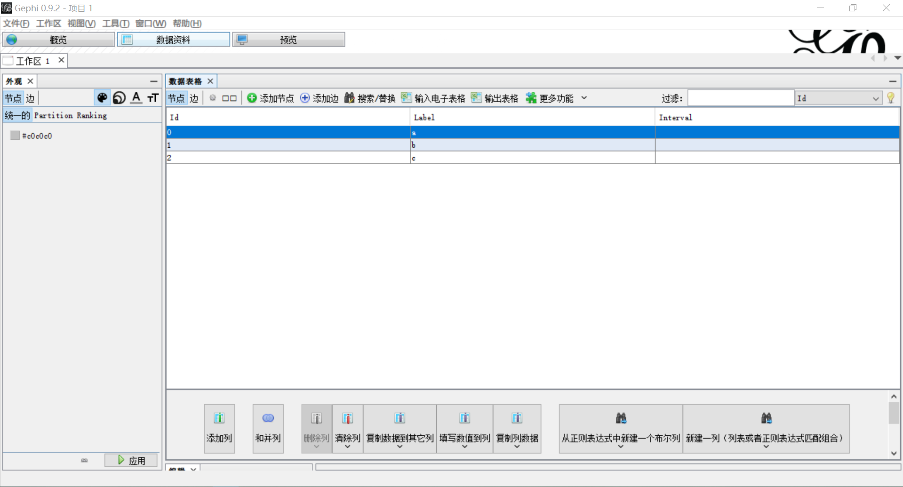
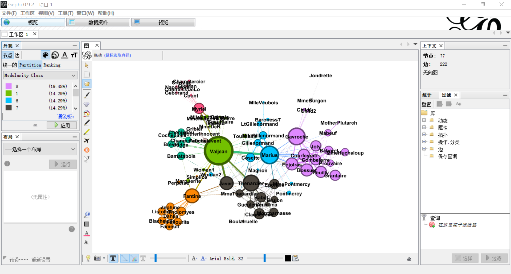

# 网络图的绘制方法

　　本文主要介绍用计算机绘制网络图的具体操作方法。我们[此前](../intro-and-lit-review/README.md#2-网络图的实现方法)已经比较了比较了 Python、JavaScript 脚本和网络分析软件三种不同绘制方法特点，并提出了相对简便易行的操作步骤，即用 Gephi 软件处理数据，再用各种 JavaScript 脚本完成可视化。由于篇幅所限，各种工具的操作方法不能一一展开，这里只是根据我们的需要，有侧重地加以说明。

## 1. Python

　　[Python](https://www.python.org/) 是一种计算机程序设计语言，以其简单易学、功能强大的特点，得到了十分广泛的应用。我们可以通过 Python 的 [Matplotlib]((https://matplotlib.org/))（Hunter, [2007](https://doi.org/10.1109/MCSE.2007.55)）和 [NetworkX](https://networkx.github.io/)（Hagberg *et al.*, [2008](conference.scipy.org/proceedings/SciPy2008/paper_2/)）两个扩展包进行网络图的制作和分析。

　　虽然使用 Python 绘制网络图对编程知识的要求相对较高，但由于目前主要的研究成果大多都是用 Python 完成的（参见 List, [2016](https://doi.org/10.1163/2405478X-00902004); [2018](https://hal.archives-ouvertes.fr/hal-01706927v2/document) 等），而作者基本上也都在网络上公开了其数据和源代码，因此我们仍打算简单介绍 Python 使用方法，以便更好地分析、利用其他学者的研究成果。

### 1.1 准备工作

　　**1.1.1** 首先，从[官方网站](https://www.python.org/downloads/release/python-374/)上下载最新版的 Python（目前最新的版本是 3.7.4，Windows 系统建议选择下载 `Windows x86-64 executable installer`）。运行安装程序时注意确定勾选以下项目：

```markdown
[x] Add Python 3.7 to PATH
[x] pip
    Installs pip, which can download and install other Python packages.
```

　　然后打开命令提示符窗口（Win + R 调出「运行」窗口，然后输入 `cmd.exe`），在窗口中输入 `python` 并单击回车，如果出现：

```powershell
$ python
Python 3.7.4 (tags/v3.7.4:e09359112e, ...) [MSC v... 64 bit (AMD64)] on win32
Type "help", "copyright", "credits" or "license" for more information.
```

就说明安装成功，已经可以开始使用了。（这里用 `$` 代替前面显示的路径，不需要手动输入。）

　　要退出 Python 环境，只需输入：

````python
>>> exit()
````

就可以回到命令提示符了。除了这种方式之外，也可以直接打开 `Python 3.7 (64-bit).exe` 可执行文件进入 Python 环境，但退出后会直接关闭窗口。

　　我们可以尝试在 Python 环境中写一个小命令：

```python
>>> print('hello, world') #打印引号中的内容
```

并单击回车，就可以在下一行显示出「hello, world」的字样了。（在 Python 语言中，井号 `#` 后的内容是注释，只是为了便于我们了解代码的内容，不会被计算机识别、执行。）

　　**1.1.2** 在命令提示符中编程，好处是每一步都能直接看到结果，但却不能保存，每次运行时都要重新输入一遍，效率比较低。因此我们还需要一个文本编辑器，常用的有 [Notepad++](https://notepad-plus-plus.org/)、[Sublime Text](www.sublimetext.com/)、[Atom](www.atom.io/) 和 [Visual Studio Code](https://code.visualstudio.com/) 等等，可以任选其一。在编辑器中完成开发后，保存为 `xxx.py` 格式，然后在命令行中输入：

```powershell
$ python xxx.py
```

就可以直接打开运行。注意：不能使用 Word 或系统自带的记事本，因为这两者都不是纯文本编辑器，会加入一些其他信息导致程序运行错误。另外，如果 `.py` 文件不在命令行显示的路径（默认是 `C:\Users\用户名`）中，要先输入 `cd` 加上文件保存的路径并回车后，再输入上述命令才能运行。

　　**1.1.3** 我们先安装 NetworkX 扩展包，用来制作和分析网络模型。在命令提示符中输入 `exit()` 暂时退出 Python 环境，然后输入：

```powershell
$ pip install networkx
```

就可以利用 Python 自带的模块管理工具 pip 安装了。如果显示：

```powershell
Successfully installed decorator-4.4.0 networkx-2.
```

就说明已经安装成功了。

　　然后，用同样的方式安装用于数据可视化的 Matplotlib 扩展包，以将网络分析生成为图片。在命令提示符中输入：

```powershell
$ pip install matplotlib
```

等待自动安装完成即可。

　　目前为止，准备工作就已经基本完成了。下面我们开始用 Python 绘制网络图。

### 1.2. 开始绘图

　　**1.2.1** 在编辑器中新建一个 `.py` 格式的文件。首先调用刚才安装的两个扩展包：

```python
import networkx as nx
import matplotlib.pyplot as plt
```

然后输入下列命令之一，以创建一个空白的网络图 `G`：

```python
G = nx.Graph() #无向图，或
G = nx.DiGraph() #有向图，或
G = nx.MultiGraph() #多重无向图，或
G = nx.MultiDigraph() #多重有向图，或
G.clear() #清空图
```

　　**1.2.2** 接下来，输入：

```python
nx.draw(G)
```

再调用 Matplotlib 扩展包，选择生成图片或直接保存到指定路径：

````python
plt.show() #生成网络图，或
plt.savefig("graph.png") #保存为graph.png
````

保存后运行这个程序（见 §1.2），稍等片刻后就可以得到一张空白的网络图了。

　　**1.2.3** 下面我们开始学习如何添加结点和边。注意：有关结点和边的命令应该添加在 §2.2 和 §2.2 的内容之间，即下面例子第四行中 `[…]` 的位置：

````python
import networkx as nx
import matplotlib.pyplot as plt
G = nx.Graph()
[...] #添加结点和边的信息
nx.draw(G)
plt.show()
````

### 1.3. 结点和边的编辑

　　**1.3.1** 结点可以逐个添加或批量添加：

```python
G.add_node('n') #添加结点n，或
G.add_nodes_from('u','v') #添加结点u、结点v，或
G.add_nodes_from([1,4]) #添加结点1、结点2、结点3、结点4
```

如果要删除结点，则：

```python
G.remove_node('n') #删除结点n，或
G.remove_nodes_from('u','v') #删除结点u、结点v
```

　　**1.3.2** 在添加结点时，还可以增加自定义的属性，如：

````python
G.add_node(1, name='n1', weight=1)
````

　　**1.3.3** 边的添加有两种方式，既可以像结点一样直接添加：

```python
G.add_edge('u','v') #添加边uv，或
G.add_edges_from([('u','v'),('p','q')]) #添加边uv、边pq
```

也可以先定义一条边，再将其作为一个整体添加：

```python
e=(u,v)
G.add_edge(*e)
```

　　删除边的命令和结点一样，只要把 `add` 替换成 `remove`：

```python
G.remove_edge('a','b') #删除边ab，或
G.remove_edges_from([('a','b'),('c','d')]) #删除边ab、边cd
```

### 1.4. 实例

　　**1.4.1** 至此为止，我们就可以得到一幅基本的网络图，更多功能可以参见[官方文档](https://networkx.github.io/documentation/stable/tutorial.html)。下面是一个简单的例子：


附源代码：

```python
import networkx as nx
import matplotlib.pyplot as plt
G = nx.Graph()

G.add_nodes_from([1, 3])
G.add_edges_from([(1, 2), (1, 3), (2, 3)])

nx.draw(G, with_labels=True)
plt.show()
```

　　**4.2** 类似地，我们也可以让 Python 按照已有的 `.gexf` 格式网络图数据，直接生成图片。只需要在 `[…]` 处输入：

````python
read_gexf(path/to.gexf) #.gexf文件的地址
````

即可，如图所示：


附源代码：

````python
import networkx as nx
import matplotlib.pyplot as plt
G = nx.Graph()

G=nx.read_gexf('.../les-miserables.gexf')

nx.draw(G, with_labels=True)
plt.show()
````

## 2. Gephi

　　[Gephi](https://gephi.org/) 是一款开源、免费、跨平台的网络分析软件。和 Python 相比，Gephi 有简单直观的图形界面，非常便于我们学习和使用。Gephi 的运行需要 [Java](https://www.java.com/zh_CN/) 环境，下载后按照步骤安装即可，在此不再赘述。下面简要介绍 Gephi 的操作方法。

### 2.1 结点和边的编辑

　　**2.1.1** 安装完成后打开 Gephi 软件，在菜单栏中选择 `文件(F) -> 新建项目` 或直接使用快捷键 `Ctrl + Shift + N` 新建一个项目，效果如图所示：


然后单击上方的「数据资料」，进入如下界面：


　　**2.1.2** 单击「添加节点」，在弹出的窗口中任意输入名称（「标记」），再选择「确定」，就会显示已经添加了一个 ID 为 `0` 的结点，如图所示：



其中，ID 是系统储存的结点名称，而 Label 则是在结点上显示给我们看的「标签」。理论上说，ID 应该越简单越好，这样可以节约文件的空间，也可以防止因为编码问题导致的错误，因此最好是阿拉伯数字；而 Label 则可以根据需要自行调整。添加完成后，可以单击右键进行编辑或删除。

　　**2.1.3** 结点添加完成后，选择「数据表格」下方的「边」，再单击「添加边」，就会显示以下窗口：


分别选择源节点和目标节点（「边种类」可以不填。显然，在无向图中头和尾的设置是可以互换的）。类似地，添加完成后也可以单击右键编辑或删除。最后，回到「概览」窗口，就可以看到网络图已经生成好了。

### 2.2 批量导入数据

　　**2.2.1** 在 Gephi 软件中可以直接导入数据。`.gexf` 格式的文件可以直接打开，如图所示：


根据需要，选择导入到新的工作区（New workspace）或添加到现有工作区（Append to existing workspace）即可。

　　**2.2.2** 但更多时候，我们只有原始数据，而需要软件为我们生成 `.gexf` 等网络图的格式，这时 Gephi 也能很好地满足我们的需要。导入的数据最好是 `.csv` 或 `.tsv` 格式，可以在 Excel 中通过文件另存为得到，也可以直接用文本编辑器（参见 [§1.1.2](#1.1-准备工作)）编辑。

　　结点的数据例如：

````
Id,Label,timeset,modularity_class
11,Valjean,,1
48,Gavroche,,8
55,Marius,,6
27,Javert,,7
25,Thenardier,,7
...
````

其中 `Id` 是必不可少的，`Label` 处于查看的方便，可以设置为汉字。`timeset` 在静态图中无需设置，`modularity_class` 则可以用来标记结点类别，并用颜色加以区分（参见 [§2.3.2](#2.3-网络图的外观)）。

　　边的数据例如：

````
Source,Target,Type,Id,Label,timeset,Weight
1,0,Undirected,0,,,1
2,0,Undirected,1,,,8
3,0,Undirected,2,,,10
3,2,Undirected,3,,,6
4,0,Undirected,4,,,1
...
````

其中 `Source` 是边的头（源节点），`Target` 是边的尾（目标节点），`Type ` 可以填写 `Undirected` 表示无向图，或用 `Directed` 表示有向图，以上三个参数是必不可少的。

　　编辑好数据后，在刚才添加结点和边的「数据资料」界面，单击「输入电子表格」，选择 `.csv` 文件后，确认输入的是结点或边的表格，注意要将字符集选为 `UTF-8` 才能正确显示汉字字符，如图所示：


导入结点和边的顺序并不固定，但在导入第二项时必须选择「添加到现有工作区」（Append to existing workspace），如图所示：


否则结点和边会分别导入到两个不同的工作表中，不能正确地显示数据。之后再回到「概览」窗口，就可以看到生成的网络图了。

### 2.3 网络图的外观

　　为了便于我们查看网络图的信息，还可以在 Gephi 中对图的外观进行设置。

　　**2.3.1** 在「概览」界面中，单击最下方黑色的字母 `T` 以显示结点的标签（label），其大小、字体和颜色可以在右侧调节，效果如图所示：


类似地，我们也可以单击白色的字母 `T` 以显示边的标签，并调节其粗细。注意：对于字体中没有的字符编码，Gephi 不能自动回退（fallback）到能够显示的字体，因此必须将默认的 `Arial Bold` 变为相应的中文字体才能正确地显示汉字。

　　**2.3.2** 我们还可以在左侧的「外观」中设置结点和边的颜色和大小，都可以按照度或 `modularity_class` 的值进行区分。在选择颜色时，`Partition` 选项卡是以不同颜色区分结点或边的属性，而 `Ranking` 则是利用颜色的浓度表现。设置完成后单击「应用」即可，调整后的效果如图所示：



　　**2.3.3** 除此之外，还可以在左下角的「布局」中进行更细致的调整，在此不再赘述。比如，`Fruchterman Reingold` 的效果如图所示：


### 2.4 网络图的保存

　　我们可以直接将网络图直接保存为 `.gephi` 格式。这种格式可以完整地保留数据和设置的各项内容，但只能在 Gephi 软件中打开。

　　如果要生成图片，有两种方式。其一是直接截屏，或者单击下方工具栏的照相机图标截屏。这种方式可以忠实地展现屏幕上的网络图，但图片的质量相对较低。另一种方法则是在菜单栏中选择 `文件(F) -> 输出 -> SVG/PDF/PNG文件`，然后在弹出的窗口中将「文件类型」设置为 `.png` 即可。

　　如果要生成 `.gexf` 文件，在菜单栏中选择 `文件(F) -> 输出 -> 图文件...`，将保存的文件类型设置为 `.gexf` 即可。要生成 `.json` 文件，则需在菜单栏中选择 `工具(T) -> 插件(G) -> 可用插件 -> JSON Exporter`，安装完成后，就可以按上述方法导出了。

## 3. JavaScript

　　JavaScript 是世界上最流行的脚本语言，几乎所有网页的交互逻辑都是由 JavaScript 驱动的，其优势正在与能够跨平台、跨浏览器地驱动网页，和用户交互。因此，我们正可以利用 JavaScript 的这一优势，在 HTML 页面中显示网络图文件；此外，JavaScript 脚本大多都有较为精致的设计，使我们不必纠结于 Gephi 软件中参数的调整，极大地方便了我们网络图的输出及其结果的查看。

### 3.1 `.json` 数据的编辑

　　JSON 的全称是 JavaScript Object Notation，是一种轻量级的数据交换格式。绘制网络图的 JavaScript 脚本，其具体的代码各不相同，但一般都可以直接导入 `.json` 格式的图文件作为数据。其语法也比较简单，只需要分别对结点和边作出描述：

````json
{
    "nodes": [
        {"id": 1, "label": "a", "group": 1},
        {"id": 2, "label": "b", "group": 1},
        {"id": 3, "label": "c", "group": 2},
    ],
        
    "links": [
        {"source": 1, "target": 2, "value": 5},
		{"source": 1, "target": 3, "value": 6},
		{"source": 2, "target": 3, "value": 2},
    ]
}
````

然后在 JavaScript 脚本中按照相应的方式引入即可。

### 3.2 Gexf.js

　　[Gexf.js](https://github.com/raphv/gexf-js) 是一款查看 `.gexf` 或 `.json` 图文件格式的插件，使用起来比较简单，只需要在下载到本地之后解压缩，把要查看的图文件复制到文件夹内。打开 `config.js`，在第四行双引号内输入图文件的名称：

````javascript
/*** USE THIS FILE TO SET OPTIONS ***/

GexfJS.setParams({
    graphFile : "les-miserables.gexf",
        /*
            The GEXF file to show ! -- can be overriden by adding
            a hash to the document location, e.g. index.html#celegans.gexf
            GEXF files can now be replaced by pre-processed JSON files (use gexf2json.py)
            for faster load time
        */
	...
````

保存后打开 `index.html` 文件即可，效果如图所示：


### 3.3 Sigma.js

　　[Sigma.js](http://sigmajs.org/) 也可以把 `.json` 格式的图文件以 JavaScript 的形式展示出来。方便的是，我们可以利用 Gephi 的 `SigmaExporter` 插件直接生成（插件的安装方法参见上 [§2.4](#2.4-网络图的保存)）。

　　插件安装完成后，在菜单栏中选择 `文件(F) -> 输出 -> Sigma.js Template...`，弹出窗口的设置说明如下图所示：


设置完成后单击确定，就会在指定目录下生成一个名为 `network` 的文件夹，打开其中的 `index.html` 文件即可，效果如图所示：


### 3.4 其他 JavaScript 脚本

　　除了上述的 Gexf.js 和 Sigma.js 之外，还有很多 JavaScript 脚本都可以完成网络图的可视化。由于具体的代码设置不尽相同，我们这里仅以非常流行的数据可视化脚本 [D3.js](https://d3js.org/) 为例进行演示。为了方便起见，我们可以用 JavaScript 的在线展示平台 [Observable](https://observablehq.com/)，以省去配置 npm 等操作环境的繁琐。

　　在 Observable 上新建一个文档，下面我们用一个代码块表示 Observable 中的一个「cell」，在第一个 cell 中输入以下代码，通过 npm 的方式引入 d3.js 插件：

````js
d3 = require("d3@5")
````

下面在双引号内输入 `.json` 文件的地址，以引入图的数据：

````js
data = d3.json("<!--文件地址-->") 
````

在 HTML/JavaScript 语言中，`<!--` 和 `-->` 之间的内容是注释信息，不会被计算机识别、执行。注意：用 Gephi 插件自动导出的文件中，边的名称是 `"edges"`，在这里要改成 `"links"` 才能被 D3.js 识别。设置网络图插件的高度，单位是 px（宽度默认是整个页面，可以不必设置）：

````js
height = 600
````

然后配置网络图的属性：

````js
color = {
	const scale = d3.scaleOrdinal(d3.schemeCategory10);
	return d => scale(d.group);
}
````

````js
drag = simulation => {
  
  function dragstarted(d) {
    if (!d3.event.active) simulation.alphaTarget(0.3).restart();
    d.fx = d.x;
    d.fy = d.y;
  }
  
  function dragged(d) {
    d.fx = d3.event.x;
    d.fy = d3.event.y;
  }
  
  function dragended(d) {
    if (!d3.event.active) simulation.alphaTarget(0);
    d.fx = null;
    d.fy = null;
  }
  
  return d3.drag()
      .on("start", dragstarted)
      .on("drag", dragged)
      .on("end", dragended);
}
````

最后，输入：

````js
chart = {
  const links = data.links.map(d => Object.create(d));
  const nodes = data.nodes.map(d => Object.create(d));

  const simulation = d3.forceSimulation(nodes)
      .force("link", d3.forceLink(links).id(d => d.id))
      .force("charge", d3.forceManyBody())
      .force("center", d3.forceCenter(width / 2, height / 2));

  const svg = d3.create("svg")
      .attr("viewBox", [0, 0, width, height]);

  const link = svg.append("g")
      .attr("stroke", "#999")
      .attr("stroke-opacity", 0.6)
    .selectAll("line")
    .data(links)
    .join("line")
      .attr("stroke-width", d => Math.sqrt(d.value));

  const node = svg.append("g")
      .attr("stroke", "#fff")
      .attr("stroke-width", 1.5)
    .selectAll("circle")
    .data(nodes)
    .join("circle")
      .attr("r", 5)
      .attr("fill", color)
      .call(drag(simulation));

  node.append("title")
      .text(d => d.id);

  simulation.on("tick", () => {
    link
        .attr("x1", d => d.source.x)
        .attr("y1", d => d.source.y)
        .attr("x2", d => d.target.x)
        .attr("y2", d => d.target.y);

    node
        .attr("cx", d => d.x)
        .attr("cy", d => d.y);
  });

  invalidation.then(() => simulation.stop());

  return svg.node();
}
````

使用快捷键 `Shift + Enter` 运行即可，效果如图所示：


其实，在同一个页面中，cell 的顺序是可以改变的。因此，我们也可以把最后的 `chart = {}` 代码块移至最前，再单击左侧的大头针按钮取消各 cell 代码的固定显示，使整个页面更加简洁。